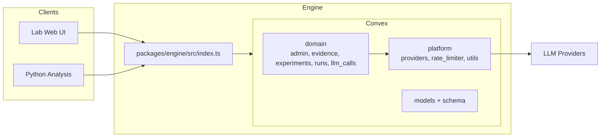
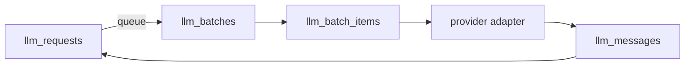
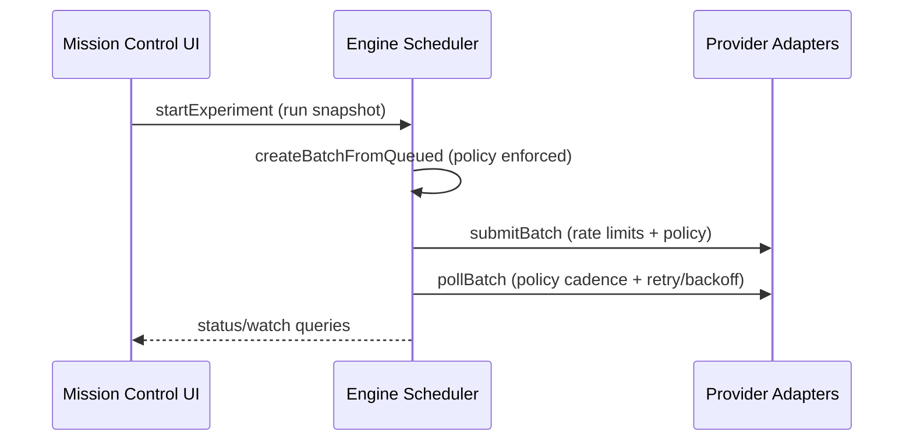

# judge-gym

An open-source LLM-as-Judge design space engine. Systematically explore how rubric/scoring model choice, rubric design, scoring method, and evidence presentation affect LLM evaluation of contested political concepts.

Inspired by [GraphGym](https://github.com/snap-stanford/GraphGym) (You et al., NeurIPS 2020) — a platform that explored 315,000 GNN designs across 32 tasks. judge-gym applies the same philosophy to LLM-as-Judge evaluation: define a design space, create experiments as config, and sweep.

Read [`paper.md`](./paper.md) for the research motivation, epistemic entrenchment framing, and theoretical framework.

---

## Monorepo Structure

```
judge-gym/
├── packages/
│   ├── engine/                        # Convex backend — the design space engine
│   │   ├── convex/
│   │   │   ├── domain/
│   │   │   │   ├── admin/             # Admin-only utilities (includes nukeTables; supports excludeEvidence)
│   │   │   │   ├── evidence/          # Evidence collection + windows
│   │   │   │   ├── experiments/       # Experiment entrypoints + stage-local workflows
│   │   │   │   ├── runs/              # Run lifecycle + stage accounting
│   │   │   │   └── llm_calls/         # Ledger: requests, batches, messages
│   │   │   ├── platform/
│   │   │   │   ├── providers/         # OpenAI/Anthropic adapters (Gemini stubbed)
│   │   │   │   ├── rate_limiter/      # Provider tiers + usage accounting
│   │   │   │   └── utils/             # Zod helpers, registries, model mapping
│   │   │   ├── models/                # Table schemas (snake_case)
│   │   │   ├── schema.ts              # Schema assembly
│   │   │   └── lab.ts                 # Public lab queries/actions
│   │   └── src/index.ts               # Single public export surface
│   │
│   ├── lab/                           # Next.js web app (Mission Control UI)
│   │
│   └── analysis/                      # Python — statistical analysis + visualization
│       ├── pyproject.toml             # uv project config
│       ├── data/                      # Local exports from Convex
│       ├── notebooks/                 # Jupyter: polarization, entrenchment, sensitivity, regression
│       └── src/judge_gym/             # Data collection + metrics + regression
│
├── paper.md                       # Working paper (theory + methodology)
└── turbo.json                     # Turborepo config
```

---

## Mission Control UI (Lab)

The Mission Control UI ships a multi-page layout focused on experiments and evidence windows.
It reads live data from Convex; set `NEXT_PUBLIC_CONVEX_URL` (or `CONVEX_URL`) for the lab app to connect.
The UI does not ship mock data; empty tables will render until Convex has data.
Experiment listings surface the latest run sample count and the frozen evidence selection size.
Evidence content can be retrieved via `lab.getEvidenceContent` for evidence window previews.
The Lab UI is built on shadcn/ui components (see `packages/lab/components/ui`) with theme tokens in `packages/lab/app/globals.css`.
Navigation is intentionally minimal: every Lab page includes the same `judge-gym` home link in the top nav.
Evidence window dates use the shadcn calendar picker, and model fields are validated via schema-backed dropdowns.
Creating an evidence window from `/editor/window` immediately kicks off evidence collection using the provided starting count.
Evidence window rows show a coarse pipeline status (scraping, cleaning, neutralizing, abstracting, ready) computed from stored evidence content.
Calendar navigation buttons are rendered as `type="button"` to prevent unintended form submissions in editors.
The experiment editor evidence window dropdown always includes a “Create new window” action that routes to `/editor/window`.
Experiment editor fields are grouped into Rubric Stage and Scoring Stage sections with minimal inline labels.
Experiment cloning is client-side only; editor query params prefill the form and stay in sync as you edit.
Experiment and evidence window tags use the `adjective-noun-id` format for concise display.

Routes:

- `/` - Experiments + evidence windows
- `/experiment/[id]` - Experiment detail
- `/evidence/[id]` - Evidence window preview
- `/editor` - Editor landing
- `/editor/experiment` - Experiment editor
- `/editor/window` - Evidence window editor

## Prerequisites

- [Bun](https://bun.sh/) (v1.1+)
- [uv](https://docs.astral.sh/uv/) (for Python analysis package)
- A [Convex](https://convex.dev/) account (free tier works for development)

### API Keys

Set these in your Convex deployment environment:

| Key                  | Required | Used By                              |
| :------------------- | :------- | :----------------------------------- |
| `OPENAI_API_KEY`     | Yes      | GPT-4.1, GPT-4.1 Mini, GPT-5.2       |
| `ANTHROPIC_API_KEY`  | Yes      | Claude Sonnet 4.5, Claude Haiku 4.5  |
| `FIRECRAWL_API_KEY`  | Yes      | Evidence collection (news scraping)  |
| `XAI_API_KEY`        | Optional | Grok 4.1 Fast                        |
| `GOOGLE_API_KEY`     | Optional | Gemini 3.0 Flash                     |
| `OPENROUTER_API_KEY` | Optional | OpenRouter models (e.g., Qwen3 235B) |

Evidence normalization uses `evidence_window.model_id`, so you must provide the
matching provider API key for the model you select.

---

## Setup

```bash
# Clone
git clone https://github.com/your-org/judge-gym.git
cd judge-gym

# Quick setup (requires bun, convex, uv)
./scripts/setup.sh

# Start Convex dev server (in a separate terminal)
cd packages/engine
bun run dev

# Set environment variables via Convex dashboard or CLI
npx convex env set OPENAI_API_KEY sk-...
npx convex env set ANTHROPIC_API_KEY sk-ant-...
npx convex env set FIRECRAWL_API_KEY fc-...

# Set up Python analysis environment
cd packages/analysis
uv sync
```

### Environment

The setup script creates `.env.local` at repo root and a `.env` symlink for
package scripts. Fill in your Convex URL (the Lab web app reads it from here):

```bash
CONVEX_URL=https://<your-deployment>.convex.cloud
```

---

## Design Space

An **experiment** is a single point in the design space. Each axis is independently configurable.
Rubric and scoring models are selected separately via the experiment config:

| Axis           | Config Field                           | Values                                                                                                                           | Default                                       |
| :------------- | :------------------------------------- | :------------------------------------------------------------------------------------------------------------------------------- | :-------------------------------------------- |
| Rubric Model   | `config.rubric_stage.model_id`         | `gpt-4.1`, `gpt-4.1-mini`, `gpt-5.2`, `claude-sonnet-4.5`, `claude-haiku-4.5`, `gemini-3.0-flash`, `grok-4.1-fast`, `qwen3-235b` | —                                             |
| Scoring Model  | `config.scoring_stage.model_id`        | `gpt-4.1`, `gpt-4.1-mini`, `gpt-5.2`, `claude-sonnet-4.5`, `claude-haiku-4.5`, `gemini-3.0-flash`, `grok-4.1-fast`, `qwen3-235b` | —                                             |
| Concept        | `evidence_window.concept`              | Free-form string (e.g., `"fascism"`, `"democratic backsliding"`)                                                                 | —                                             |
| Task Type      | `task_type`                            | `ecc`, `control`, `benchmark`                                                                                                    | —                                             |
| Scoring Method | `config.scoring_stage.method`          | `single`, `subset`                                                                                                               | `subset`                                      |
| Scale Size     | `config.rubric_stage.scale_size`       | `3`, `4`, `5`                                                                                                                    | `4`                                           |
| Evidence View  | `config.scoring_stage.evidence_view`   | `l0_raw` / `l1_cleaned` / `l2_neutralized` / `l3_abstracted`                                                                     | `l2_neutralized`                              |
| Randomizations | `config.scoring_stage.randomizations`  | array of `anonymize_labels`, `shuffle_rubric_order`, `hide_label_text`                                                           | `["anonymize_labels","shuffle_rubric_order"]` |
| Abstain Gate   | `config.scoring_stage.abstain_enabled` | `true` / `false`                                                                                                                 | `true`                                        |

Run-level knobs are supplied when you start a run (not in the experiment config):

| Run Parameter | Field                     | Values       | Default |
| :------------ | :------------------------ | :----------- | :------ |
| Sample Count  | `run_counts.sample_count` | integer >= 1 | —       |

To run a new ablation, create experiment records with different parameter values. No code changes needed.
Evidence windows are defined by `evidence_window.start_date`, `evidence_window.end_date`, `evidence_window.country`, `evidence_window.concept`, and `evidence_window.model_id`, and are reused across experiments with the same window key. Evidence selection is frozen at experiment creation by storing the chosen evidence IDs.

---

## Running Experiments

All experiment operations are exposed via Convex public mutations and queries. The public façade lives in `packages/engine/convex/lab.ts` and mirrors setup, evidence collection, experiment init, and run lifecycle entrypoints. Operate via the Mission Control web UI, Convex CLI, or MCP.

### Option A — Mission Control Web App (recommended)

From repo root, start the engine + web app together:

```bash
bun run dev
```

Then open `http://localhost:3000` to view the Mission Control UI.

If you already have Convex running in another terminal, you can start just the web app:

```bash
cd packages/lab
bun run dev
```

### Option B — CLI + Manual Workflow

#### 1. Create an evidence window + collect evidence

```bash
# Create the evidence window
npx convex run domain/experiments/experiments_entrypoints:initEvidenceWindow '{
  "evidence_window": {
    "start_date": "2026-01-01",
    "end_date": "2026-01-31",
    "country": "USA",
    "concept": "fascism",
    "model_id": "gpt-4.1"
  }
}'

# Collect evidence into the window
npx convex run domain/evidence/evidence_entrypoints:collectEvidence '{
  "window_id": "<window_id>",
  "evidence_limit": 10
}'

# Inspect evidence IDs for selection
npx convex run lab:listEvidenceByWindow '{"window_id":"<window_id>"}'
```

#### 2. Init the experiment (freezes evidence selection)

```bash
npx convex run domain/experiments/experiments_entrypoints:initExperiment '{
  "window_id": "<window_id>",
  "evidence_ids": ["<evidence_id_1>", "<evidence_id_2>"],
  "experiment": {
    "task_type": "ecc",
    "config": {
      "rubric_stage": { "scale_size": 4, "model_id": "gpt-4.1" },
      "scoring_stage": {
        "model_id": "gpt-4.1",
        "method": "subset",
        "randomizations": ["anonymize_labels","shuffle_rubric_order"],
        "evidence_view": "l2_neutralized",
        "abstain_enabled": true
      }
    }
  }
}'
```

#### 3. Start a run (auto-queues rubric + scoring)

```bash
npx convex run domain/runs/runs_entrypoints:startExperiment \
  '{"experiment_id":"<experiment_id>","run_counts":{"sample_count":10}}'
```

#### 3. Query results

```bash
# Experiment summary
npx convex run domain/experiments/experiments_data:getExperimentSummary \
  '{"experiment_id":"<experiment_id>"}'

# Export bundle for analysis (scores + evidence + rubrics)
npx convex run domain/experiments/experiments_data:exportExperimentBundle \
  '{"experiment_id":"<experiment_id>"}'
```

---

## Architecture Overview

The system is split into a Convex engine (domain + platform), a Lab web app, and a Python analysis package. The engine exposes a single public API surface via `packages/engine/src/index.ts`.



## Pipeline Stages

Stages are stage-local workflows under `packages/engine/convex/domain/experiments/stages/*`.

| Stage | Name                | What It Does                                               | Key Module        |
| :---- | :------------------ | :--------------------------------------------------------- | :---------------- |
| S1    | evidence_clean      | Normalize raw evidence and clean text                      | `stages/evidence` |
| S2    | evidence_neutralize | Mask/neutralize labels or tone for ECC/Control experiments | `stages/evidence` |
| S3    | evidence_abstract   | Optionally abstract evidence text                          | `stages/evidence` |
| S4    | rubric_gen          | Generate rubric stages for the concept                     | `stages/rubric`   |
| S5    | rubric_critic       | Critique rubric quality + enforce parsing rules            | `stages/rubric`   |
| S6    | score_gen           | Score evidence against rubric with strategy-driven prompts | `stages/scoring`  |
| S7    | score_critic        | Critique score outputs and confirm parse validity          | `stages/scoring`  |

---

## Ledger + Idempotency Guarantees

LLM calls are normalized into a request ledger so retries are safe and auditable. Idempotency is enforced by an identity tuple and a `getOrCreate` request helper.



Idempotency identity tuple:
`stage`, `provider`, `model`, `run_id`, `experiment_id`, `rubric_id`, `sample_id`, `evidence_id`, `request_version`.

To force a new LLM call for the same identity, you must explicitly bump `request_version`. Otherwise retries resolve to the same ledger row.

---

## Engine Settings

Run policy defaults and provider rate limits live in a single source of truth:
`packages/engine/convex/settings.ts` (`ENGINE_SETTINGS`). The Mission Control UI
does not define or pass policies.

Each run snapshots the current `ENGINE_SETTINGS.run_policy` at start time.
Updating settings only affects new runs; existing runs keep their snapshot for
reproducibility.

The run policy includes `max_request_attempts` (total attempts per request,
including parse retries) and `max_batch_retries` (batch-level failures).

---

## Policy Enforcement + Infra Sync

Run policies are stored as immutable per-run snapshots (derived from
`ENGINE_SETTINGS`) and enforced server-side across the batch lifecycle. The
engine scheduler handles queueing, submission, and polling.



---

## Public API Surface

The only public export surface is `packages/engine/src/index.ts`. The Mission Control UI and Analysis import from `@judge-gym/engine`.

```ts
import { api, ENGINE_SETTINGS, type ExperimentConfig } from "@judge-gym/engine";
```

Analysis pulls bundles via the public Convex HTTP API (`domain/experiments/experiments_data:exportExperimentBundle`), which is the stable boundary for downstream data workflows.

---

## Architecture Principles

- **Experiments are data, not code.** Every ablation is a config record. No code changes to run new experiments.
- **Domain/platform split.** Experiments, runs, and LLM ledgers live under `domain/`; providers, rate limits, and shared utilities live under `platform/`.
- **Ledger-first batching.** LLM calls are tracked in `llm_requests`, batched in `llm_batches`, and resolved into `llm_messages`.
- **Policy-driven orchestration.** Run policies are persisted and enforced across queue/submit/poll/finalize.
- **Engine-owned settings.** Policy defaults and rate limits are centralized in `packages/engine/convex/settings.ts`.
- **Engine-owned scheduler.** The Convex scheduler drives batch queueing, submission, and polling.
- **Stage locality.** Prompts, parsers, and workflows live under each stage folder to keep context together.
- **Clean public surface.** External consumers import only from `packages/engine/src/index.ts`.

---

## Analysis Package

The Python analysis package lives in `packages/analysis/` and operates on data exported from the engine.

```bash
cd packages/analysis
uv sync
uv run jupyter lab
```

### Notebooks

| Notebook                | Purpose                                                            |
| :---------------------- | :----------------------------------------------------------------- |
| `01_polarization.ipynb` | JSD across model families, score distribution heatmaps             |
| `02_entrenchment.ipynb` | Entrenchment Index ($P \times \text{Prob}_{expert}$), DST conflict |
| `03_sensitivity.ipynb`  | Sensitivity analysis, confidence collapse detection                |
| `04_regression.ipynb`   | OLS: Score ~ Model + RubricQuality + Concept                       |

### Key Modules

| Module               | What It Does                                                                                |
| :------------------- | :------------------------------------------------------------------------------------------ |
| `collect.py`         | Pull data from Convex via HTTP API into pandas DataFrames                                   |
| `metrics.py`         | JSD, Entrenchment Index, Swap Sensitivity                                                   |
| `dempster_shafer.py` | DST mass assignment, Dempster's rule combination, belief/plausibility, cross-model conflict |
| `regression.py`      | OLS regression models                                                                       |

---

## Adding a New Ablation Axis

To add a new design space dimension (e.g., `promptLanguage: "english" | "formal-academic" | "simplified"`):

1. **Schema** — Add the field to `ExperimentConfigSchema` in `packages/engine/convex/models/core.ts`
2. **Strategy** — Create `packages/engine/convex/domain/experiments/strategies/experiments_language.strategy.ts` (pure function: config → typed behavior)
3. **Resolve** — Add to `packages/engine/convex/domain/experiments/strategies/experiments_resolve.ts`
4. **Consume** — Use the resolved strategy in the relevant stage workflow

**Files touched: 3–4.** No schema migrations beyond config, no prompt surgery, no agent logic changes.

---

## Agentic Integrations

- [ ] todo: edit this section

The engine is designed to be operated from within Cursor via the Convex MCP server. See [`packages/engine/AGENTS.md`](./packages/engine/AGENTS.md) for the full agent instruction set including:

- Setup checklist
- Public mutation/query reference
- Workflow recipes
- Debug procedures

---

## License

OpenRAIL-S License
