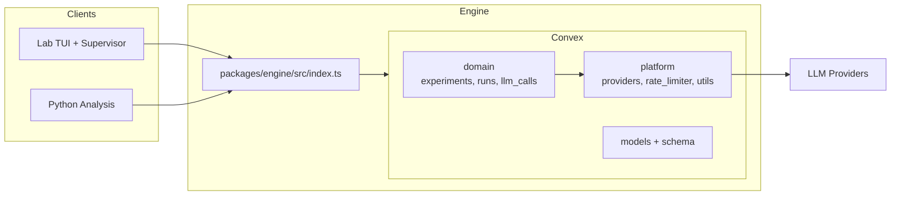
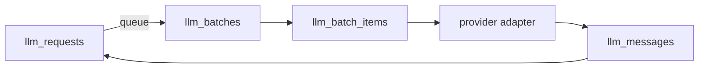
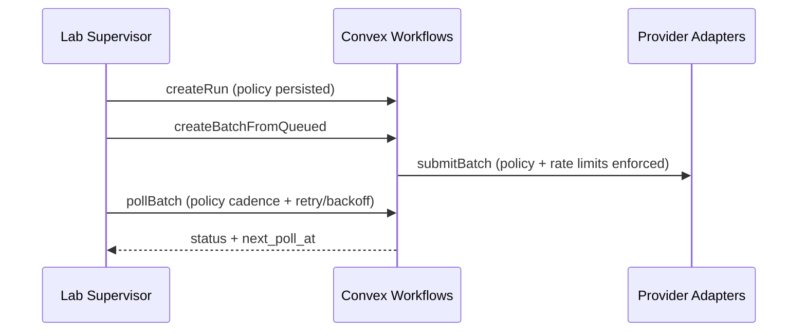

# judge-gym

An open-source LLM-as-Judge design space engine. Systematically explore how rubric/scoring model choice, rubric design, scoring method, and evidence presentation affect LLM evaluation of contested political concepts.

Inspired by [GraphGym](https://github.com/snap-stanford/GraphGym) (You et al., NeurIPS 2020) — a platform that explored 315,000 GNN designs across 32 tasks. judge-gym applies the same philosophy to LLM-as-Judge evaluation: define a design space, create experiments as config, and sweep.

Read [`paper.md`](./paper.md) for the research motivation and theoretical framework.

---

## Monorepo Structure

```
judge-gym/
├── packages/
│   ├── engine/                        # Convex backend — the design space engine
│   │   ├── convex/
│   │   │   ├── domain/
│   │   │   │   ├── experiments/       # Experiment entrypoints + stage-local workflows
│   │   │   │   ├── runs/              # Run lifecycle + stage accounting
│   │   │   │   └── llm_calls/         # Ledger: requests, batches, messages
│   │   │   ├── platform/
│   │   │   │   ├── providers/         # OpenAI/Anthropic adapters (Gemini stubbed)
│   │   │   │   ├── rate_limiter/      # Provider tiers + usage accounting
│   │   │   │   └── utils/             # Zod helpers, registries, model mapping
│   │   │   ├── models/                # Table schemas (snake_case)
│   │   │   ├── schema.ts              # Schema assembly
│   │   │   └── lab.ts                 # Public lab queries/actions
│   │   └── src/index.ts               # Single public export surface
│   │
│   ├── lab/                           # Ink TUI + supervisor loop
│   │   └── src/
│   │
│   └── analysis/                      # Python — statistical analysis + visualization
│       ├── pyproject.toml             # uv project config
│       ├── data/                      # Local exports from Convex
│       ├── notebooks/                 # Jupyter: polarization, entrenchment, sensitivity, regression
│       └── src/judge_gym/             # Data collection + metrics + regression
│
├── paper.md                       # Working paper (theory + methodology)
└── turbo.json                     # Turborepo config
```

---

## Prerequisites

- [Bun](https://bun.sh/) (v1.1+)
- [uv](https://docs.astral.sh/uv/) (for Python analysis package)
- A [Convex](https://convex.dev/) account (free tier works for development)

### API Keys

Set these in your Convex deployment environment:

| Key                  | Required | Used By                              |
| :------------------- | :------- | :----------------------------------- |
| `OPENAI_API_KEY`     | Yes      | GPT-4.1, GPT-4.1 Mini, GPT-5.2       |
| `ANTHROPIC_API_KEY`  | Yes      | Claude Sonnet 4.5, Claude Haiku 4.5  |
| `FIRECRAWL_API_KEY`  | Yes      | Evidence collection (news scraping)  |
| `XAI_API_KEY`        | Optional | Grok 4.1 Fast                        |
| `GOOGLE_API_KEY`     | Optional | Gemini 3.0 Flash                     |
| `OPENROUTER_API_KEY` | Optional | OpenRouter models (e.g., Qwen3 235B) |

---

## Setup

```bash
# Clone
git clone https://github.com/your-org/judge-gym.git
cd judge-gym

# Quick setup (requires bun, convex, uv)
./scripts/setup.sh

# Start Convex dev server (in a separate terminal)
cd packages/engine
bun run dev

# Set environment variables via Convex dashboard or CLI
npx convex env set OPENAI_API_KEY sk-...
npx convex env set ANTHROPIC_API_KEY sk-ant-...
npx convex env set FIRECRAWL_API_KEY fc-...

# Set up Python analysis environment
cd packages/analysis
uv sync
```

### Environment

The setup script creates `.env.local` at repo root and a `.env` symlink for
package scripts. Fill in your Convex URL:

```bash
CONVEX_URL=https://<your-deployment>.convex.cloud
```

---

## Design Space

An **experiment** is a single point in the design space. Each axis is independently configurable.
Rubric and scoring models are selected separately via the experiment config:

| Axis            | Config Field             | Values                                                                                                                           | Default                                 |
| :-------------- | :----------------------- | :------------------------------------------------------------------------------------------------------------------------------- | :-------------------------------------- |
| Rubric Model    | `config.rubric_model_id` | `gpt-4.1`, `gpt-4.1-mini`, `gpt-5.2`, `claude-sonnet-4.5`, `claude-haiku-4.5`, `gemini-3.0-flash`, `grok-4.1-fast`, `qwen3-235b` | —                                       |
| Scoring Model   | `config.scoring_model_id` | `gpt-4.1`, `gpt-4.1-mini`, `gpt-5.2`, `claude-sonnet-4.5`, `claude-haiku-4.5`, `gemini-3.0-flash`, `grok-4.1-fast`, `qwen3-235b` | —                                       |
| Concept         | `window.concept`         | Free-form string (e.g., `"fascism"`, `"democratic backsliding"`)                                                                 | —                                       |
| Task Type       | `task_type`              | `ecc`, `control`, `benchmark`                                                                                                    | —                                       |
| Scoring Method  | `config.scoring_method`  | `freeform-suffix-single`, `freeform-suffix-subset`                                                                               | `freeform-suffix-subset`                |
| Scale Size      | `config.scale_size`      | `3`, `4`, `5`                                                                                                                    | `4`                                     |
| Evidence View   | `config.evidence_view`   | `raw` / `cleaned` / `neutralized` / `abstracted`                                                                                 | `neutralized`                           |
| Randomizations  | `config.randomizations`  | array of `anon-label`, `rubric-order-shuffle`, `hide-label-name`                                                                 | `["anon-label","rubric-order-shuffle"]` |
| Prompt Ordering | `config.prompt_ordering` | `rubric-first`, `evidence-first`                                                                                                 | `rubric-first`                          |
| Abstain Gate    | `config.abstain_enabled` | `true` / `false`                                                                                                                 | `true`                                  |
| Ground Truth    | `ground_truth`           | `{ source, value?, label? }` (only for `control` / `benchmark`)                                                                  | —                                       |

To run a new ablation, create experiment records with different parameter values. No code changes needed.
Evidence windows are defined by `window.start_date`, `window.end_date`, `window.country`, and `window.concept`, and are reused across experiments with the same window key.

---

## Running Experiments

All experiment operations are exposed via Convex public mutations and queries. Operate via the Convex dashboard, CLI, or MCP.

### Option A — Lab TUI (recommended)

1. Start Convex dev server in `packages/engine`.
2. From repo root, start the lab supervisor:

```bash
bun run lab
```

Optional flags:

```bash
LAB_BOOTSTRAP=1 NEW_RUN=1 bun run lab
```

### Option B — Manual workflow (CLI)

#### 1. Initialize window + experiment

```bash
npx convex run domain/experiments/entrypoints:initExperiment '{
  "window": {
    "start_date": "2026-01-01",
    "end_date": "2026-01-31",
    "country": "USA",
    "concept": "fascism"
  },
  "experiment": {
    "experiment_tag": "pilot_fascism_gpt4.1",
    "task_type": "ecc",
    "config": {
      "scale_size": 4,
      "rubric_model_id": "gpt-4.1",
      "scoring_model_id": "gpt-4.1",
      "randomizations": ["anon-label", "rubric-order-shuffle"],
      "evidence_view": "neutralized",
      "scoring_method": "freeform-suffix-subset",
      "prompt_ordering": "rubric-first",
      "abstain_enabled": true
    }
  }
}'
# → returns windowId + experimentId (reused if they already exist)
```

#### 2. Create a run + queue work

```bash
# Create a run
npx convex run domain/runs/entrypoints:createRun \
  '{"experiment_tag":"pilot_fascism_gpt4.1"}'

# Queue rubric generation
npx convex run domain/experiments/entrypoints:queueRubricGeneration \
  '{"experiment_tag":"pilot_fascism_gpt4.1"}'

# Queue scoring (N samples per evidence item)
npx convex run domain/experiments/entrypoints:queueScoreGeneration \
  '{"experiment_tag":"pilot_fascism_gpt4.1","sample_count":5}'

```

#### 3. Query results

```bash
# Experiment summary
npx convex run domain/experiments/data:getExperimentSummary \
  '{"experiment_tag":"pilot_fascism_gpt4.1"}'

# Export bundle for analysis (scores + evidence + rubrics)
npx convex run domain/experiments/data:exportExperimentBundle \
  '{"experiment_tag":"pilot_fascism_gpt4.1"}'
```

---

## Architecture Overview

The system is split into a Convex engine (domain + platform), a Lab supervisor client, and a Python analysis package. The engine exposes a single public API surface via `packages/engine/src/index.ts`.



## Pipeline Stages

Stages are stage-local workflows under `packages/engine/convex/domain/experiments/stages/*`.

| Stage | Name                | What It Does                                                                 | Key Module |
| :---- | :------------------ | :--------------------------------------------------------------------------- | :--------- |
| S1    | evidence_clean      | Normalize raw evidence and clean text                                       | `stages/evidence` |
| S2    | evidence_neutralize | Mask/neutralize labels or tone for ECC/Control experiments                  | `stages/evidence` |
| S3    | evidence_abstract   | Optionally abstract evidence text                                           | `stages/evidence` |
| S4    | rubric_gen          | Generate rubric stages for the concept                                      | `stages/rubric` |
| S5    | rubric_critic       | Critique rubric quality + enforce parsing rules                             | `stages/rubric` |
| S6    | score_gen           | Score evidence against rubric with strategy-driven prompts                  | `stages/scoring` |
| S7    | score_critic        | Critique score outputs and confirm parse validity                           | `stages/scoring` |

---

## Ledger + Idempotency Guarantees

LLM calls are normalized into a request ledger so retries are safe and auditable. Idempotency is enforced by an identity tuple and a `getOrCreate` request helper.



Idempotency identity tuple:
`stage`, `provider`, `model`, `experiment_id`, `rubric_id`, `sample_id`, `evidence_id`, `request_version`.

To force a new LLM call for the same identity, you must explicitly bump `request_version`. Otherwise retries resolve to the same ledger row.

---

## Policy Enforcement + Infra Sync

Run policies are stored on each run and enforced server-side across the entire batch lifecycle. The Lab supervisor mirrors the policy locally for pacing, but it does not override the server.



If the Lab `RUN_POLICY` diverges from the persisted run policy, the server will reject batches (`policy_denied`). Keep both in sync.

---

## Public API Surface

The only public export surface is `packages/engine/src/index.ts`. Lab and Analysis import from `@judge-gym/engine`.

```ts
import { api, RunPolicySchema, type ExperimentConfig } from "@judge-gym/engine";
```

Analysis pulls bundles via the public Convex HTTP API (`domain/experiments/data:exportExperimentBundle`), which is the stable boundary for downstream data workflows.

---

## Architecture Principles

- **Experiments are data, not code.** Every ablation is a config record. No code changes to run new experiments.
- **Domain/platform split.** Experiments, runs, and LLM ledgers live under `domain/`; providers, rate limits, and shared utilities live under `platform/`.
- **Ledger-first batching.** LLM calls are tracked in `llm_requests`, batched in `llm_batches`, and resolved into `llm_messages`.
- **Policy-driven orchestration.** Run policies are persisted and enforced across queue/submit/poll/finalize.
- **Stage locality.** Prompts, parsers, and workflows live under each stage folder to keep context together.
- **Clean public surface.** External consumers import only from `packages/engine/src/index.ts`.

---

## Analysis Package

The Python analysis package lives in `packages/analysis/` and operates on data exported from the engine.

```bash
cd packages/analysis
uv sync
uv run jupyter lab
```

### Notebooks

| Notebook                | Purpose                                                            |
| :---------------------- | :----------------------------------------------------------------- |
| `01_polarization.ipynb` | JSD across model families, score distribution heatmaps             |
| `02_entrenchment.ipynb` | Entrenchment Index ($P \times \text{Prob}_{expert}$), DST conflict |
| `03_sensitivity.ipynb`  | Sensitivity analysis, confidence collapse detection                |
| `04_regression.ipynb`   | OLS: Score ~ Model + RubricQuality + Concept                       |

### Key Modules

| Module               | What It Does                                                                                |
| :------------------- | :------------------------------------------------------------------------------------------ |
| `collect.py`         | Pull data from Convex via HTTP API into pandas DataFrames                                   |
| `metrics.py`         | JSD, Entrenchment Index, Swap Sensitivity                                                   |
| `dempster_shafer.py` | DST mass assignment, Dempster's rule combination, belief/plausibility, cross-model conflict |
| `regression.py`      | OLS regression models                                                                       |

---

## Adding a New Ablation Axis

To add a new design space dimension (e.g., `promptLanguage: "english" | "formal-academic" | "simplified"`):

1. **Schema** — Add the field to `ExperimentConfigSchema` in `packages/engine/convex/models/core.ts`
2. **Strategy** — Create `packages/engine/convex/domain/experiments/strategies/language.strategy.ts` (pure function: config → typed behavior)
3. **Resolve** — Add to `packages/engine/convex/domain/experiments/strategies/resolve.ts`
4. **Consume** — Use the resolved strategy in the relevant stage workflow

**Files touched: 3–4.** No schema migrations beyond config, no prompt surgery, no agent logic changes.

---

## Agentic Integrations

- [ ] todo: edit this section

The engine is designed to be operated from within Cursor via the Convex MCP server. See [`packages/engine/AGENTS.md`](./packages/engine/AGENTS.md) for the full agent instruction set including:

- Setup checklist
- Public mutation/query reference
- Workflow recipes
- Debug procedures

---

## License

OpenRAIL-S License
