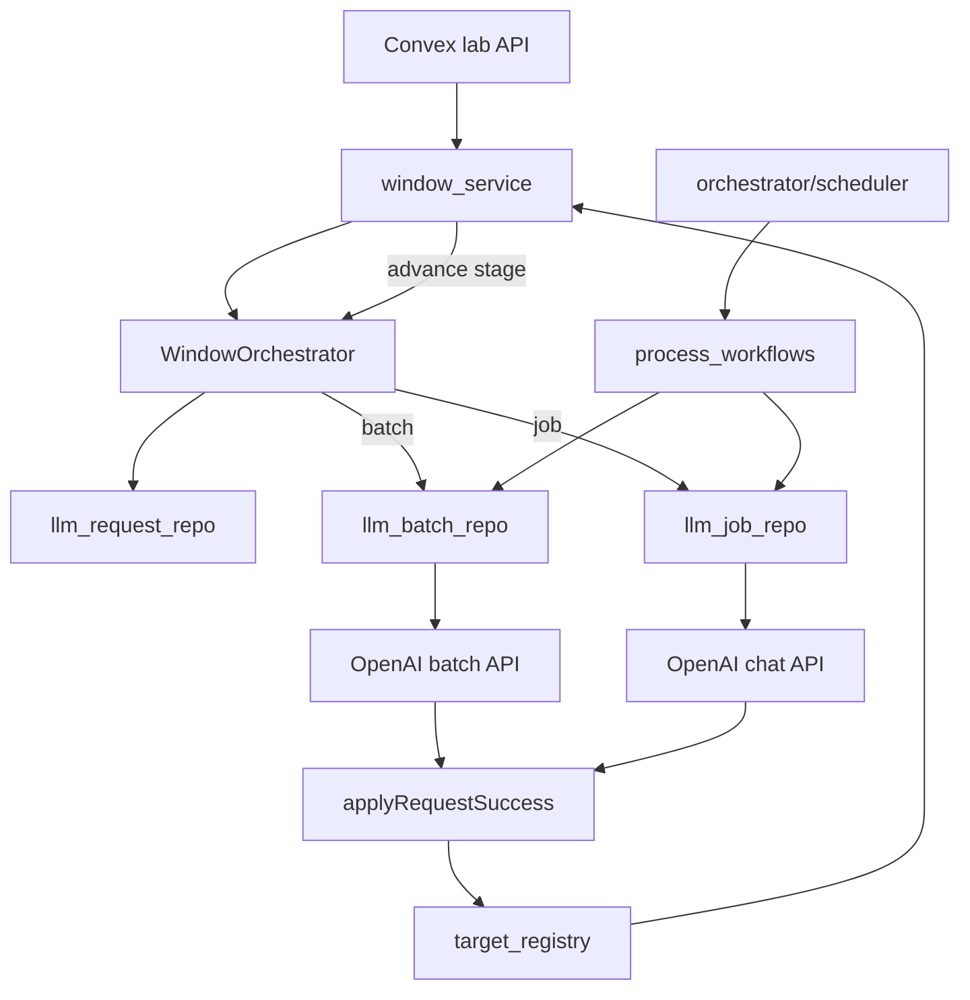
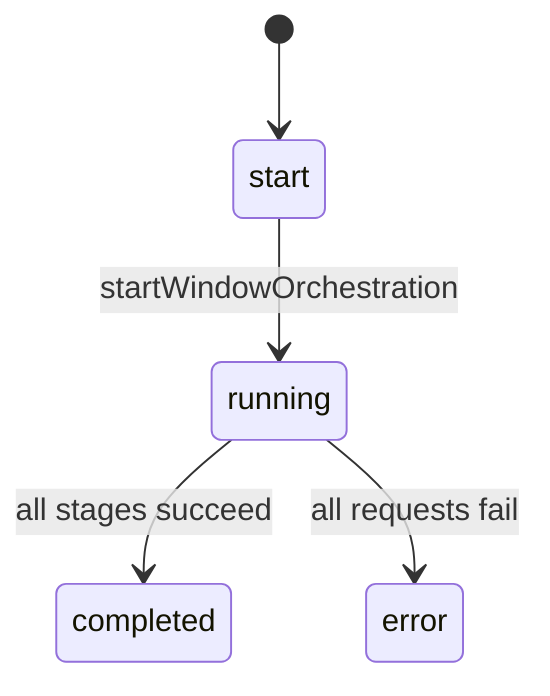
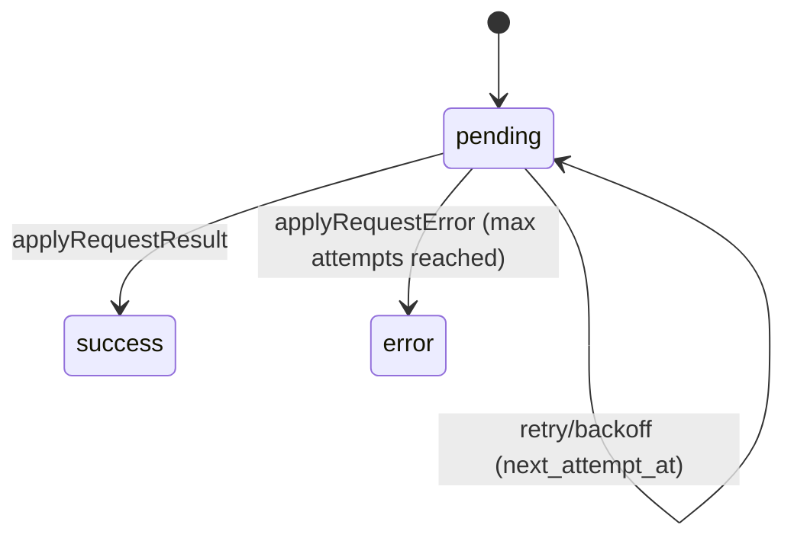
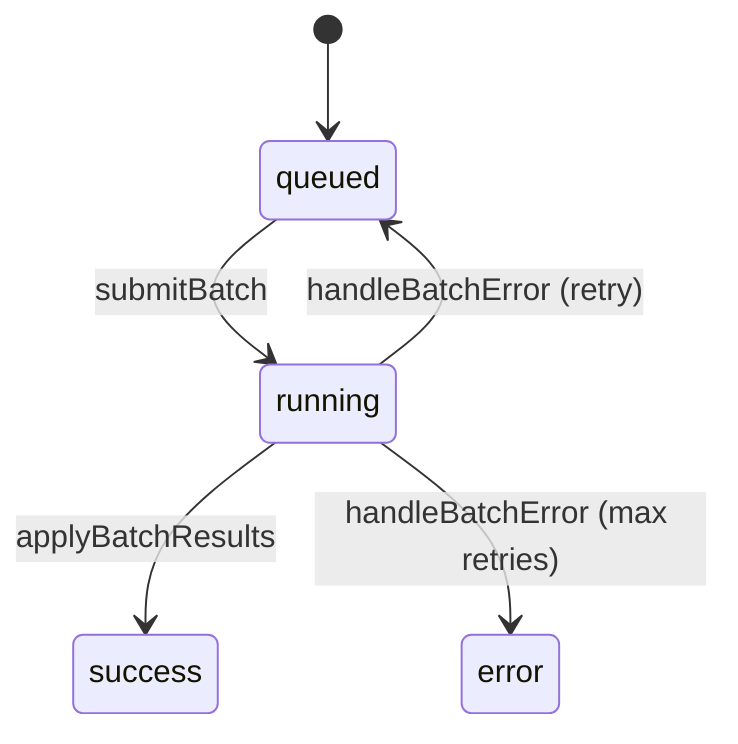
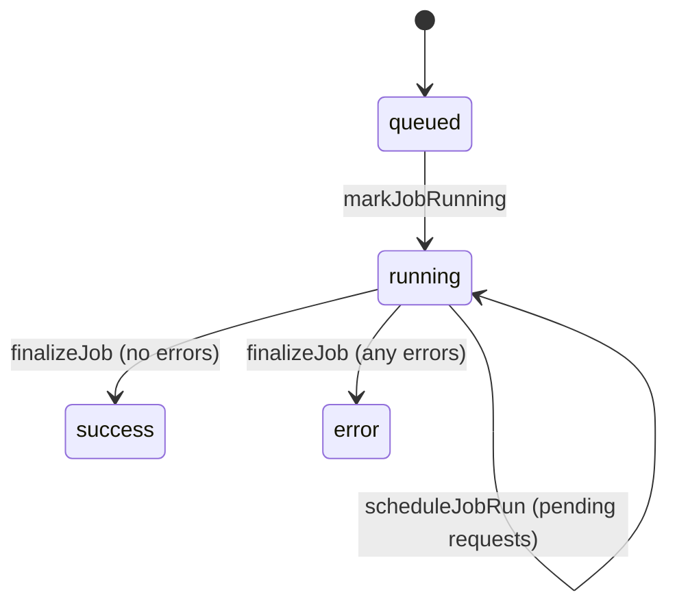

# judge-gym

An open-source LLM-as-Judge design space engine. judge-gym focuses on how rubric design, scoring models, scoring methods, and evidence presentation affect LLM evaluation of contested political concepts.

This README documents the **current implementation in `judge-gym/` only** and is intentionally self-contained. It does not assume features that exist only in `v0-old/` or `v1-target/`.

**Prerequisites**
- Node.js `>=22.12.0`
- Bun `>=1.1.27`

**Node version management (nvm)**
This repo pins Node via `.nvmrc` to keep all packages on the same version.
1. `nvm install 22.12.0`
2. `nvm use 22.12.0`
3. `nvm alias default 22.12.0`

**What exists today**
- Evidence windows are fully orchestrated in the Convex engine with a 3-stage LLM pipeline (clean → neutralize → abstract).
- The engine has a scheduler, batch/job orchestration, and rate limiting.
- Run-level experiment orchestration (rubric generation + scoring + critics) is implemented in the Convex engine.
- Experiment initialization now freezes evidence selections via `experiment_evidence`.

**What does not exist yet (in this repo)**
- An implementation of `data:exportExperimentBundle` used by the analysis client.
- A runtime override layer for `ENGINE_SETTINGS`.

---

## Repo Organization

**Top-level packages**
| Path | Role |
| --- | --- |
| `packages/engine` | Convex backend: schema, orchestrators, scheduler, provider calls, rate limiting, data access |
| `packages/lab` | Next.js app (UI client for evidence windows) |
| `packages/analysis` | Python client for pulling experiment data from Convex |
| `paper.md` | Research framing |

**Engine internals (`packages/engine/convex/`)**
| Path | Role |
| --- | --- |
| `domain/orchestrator/` | Scheduler, workflows, routing of LLM results |
| `domain/llm_calls/` | Batch/job/request repos + services |
| `domain/experiments/` | Experiment creation + evidence binding |
| `domain/runs/` | Run orchestration for rubric + scoring stages |
| `domain/window/` | Evidence window orchestration + search |
| `models/` | Zod schemas for tables and shared enums |
| `platform/` | Providers, rate limiter, run policy |
| `packages/` | Public Convex API surfaces (e.g. `lab.ts`) |
| `utils/` | Scheduling helpers, zod helpers, tags |
| `schema.ts` | Convex table definitions + indexes |

**Key submodules**
| Path | What it contains |
| --- | --- |
| `domain/orchestrator/base.ts` | Base orchestration logic + batch vs job decision |
| `domain/orchestrator/scheduler.ts` | Scheduler loop + requeue handling |
| `domain/orchestrator/process_workflows.ts` | Batch/job workflow state machine |
| `domain/orchestrator/target_registry.ts` | Custom key routing to domain handlers |
| `domain/llm_calls/*_repo.ts` | Batch/job/request storage mutations and queries |
| `domain/llm_calls/*_service.ts` | Rate limit checks, retries, apply results |
| `domain/experiments/experiments_entrypoints.ts` | Experiment creation + evidence binding |
| `domain/experiments/experiments_repo.ts` | Experiment storage + evidence queries |
| `domain/runs/run_orchestrator.ts` | Stage configs + pending/advance helpers + run prompt orchestration |
| `domain/runs/run_service.ts` | Run lifecycle, apply results, stage advancement |
| `domain/runs/run_repo.ts` | Run/sample + rubric/score persistence |
| `domain/window/window_orchestrator.ts` | Stage configs + evidence-specific orchestration |
| `domain/window/window_service.ts` | Window lifecycle, apply results, stage advancement |
| `domain/window/window_repo.ts` | Evidence search + insert + queries |
| `domain/window/evidence_search.ts` | Firecrawl-based news search |
| `platform/providers/*` | OpenAI batch + chat integrations |
| `platform/rate_limiter/*` | Token bucket configs + rate limiter wiring |
| `models/*` | Table schemas and shared enums |
| `utils/scheduling.ts` | `getNextRunAt`, `getNextAttemptAt` helpers |

---

## Data Model (Core Tables)

**Orchestration tables**
| Table | Purpose | Key fields |
| --- | --- | --- |
| `windows` | Evidence window state | `status`, `current_stage`, `model`, `query`, `country`, `start_date`, `end_date`, `window_tag` |
| `evidences` | Evidence items for a window | `window_id`, `l0_raw_content`, `l1/l2/l3_*_content`, `l1/l2/l3_request_id` |
| `llm_requests` | Individual LLM calls | `status`, `model`, `custom_key`, `attempts`, `next_attempt_at`, `job_id`, `batch_id` |
| `llm_jobs` | Non-batched request groups | `status`, `model`, `custom_key`, `next_run_at`, `last_error` |
| `llm_batches` | Batched request groups | `status`, `model`, `custom_key`, `batch_ref`, `attempts`, `next_poll_at`, `last_error` |

**Experiment and run tables (orchestrated)**
| Table | Purpose | Key fields |
| --- | --- | --- |
| `experiments` | Experiment configs | `experiment_tag`, `rubric_config`, `scoring_config` |
| `runs` | Run metadata | `status`, `experiment_id`, `current_stage`, `target_count` |
| `samples` | Run samples | `run_id`, `rubric_id`, `score_id`, critic IDs |
| `rubrics`, `scores`, `rubric_critics`, `score_critics` | LLM outputs | LLM request IDs + metadata |

**Indexes that drive orchestration**
- `evidences.by_window_l1_pending`, `by_window_l2_pending`, `by_window_l3_pending` gate per-stage work.
- `llm_requests.by_orphaned` identifies pending requests without a batch or job.
- `llm_batches.by_status`, `llm_jobs.by_status` allow scheduler polling by status.

---

## Orchestration Flow (End-to-End)

**High-level path**
1. A window is created via `window_repo.createWindow` with status `start` and stage `l0_raw`.
2. `startWindowFlow` checks for existing evidence; if none exist, it runs `collectWindowEvidence`, calls `evidence_search.searchNews` (Firecrawl), and inserts evidence rows with `l0_raw_content`.
3. `startWindowOrchestration` sets the window to `running`, sets `current_stage` to `l1_cleaned`, and calls `WindowOrchestrator.enqueueStage`.
4. `WindowOrchestrator.enqueueStage` lists pending evidence for the stage using the stage-specific index.
5. The orchestrator builds prompts and creates one `llm_request` per evidence item.
6. The orchestrator records the request ID on the evidence row.
7. The orchestrator routes the request set to a **batch** or **job** based on the run policy.
8. The scheduler polls queued/running batches and jobs, starting workflows when `next_*` timestamps are due.
9. Workflows submit to the provider, poll for results, and apply outputs.
10. `applyRequestResult` updates the evidence output field and calls `maybeAdvanceWindowStage`.
11. `maybeAdvanceWindowStage` advances to the next stage or completes the window if all evidence items are done.

**Run flow (experiment)**
1. `initExperiment` creates an experiment and freezes selected evidence in `experiment_evidence`.
2. `startRunFlow` creates a run, seeds `samples`, and sets `current_stage` to `rubric_gen`.
3. `RunOrchestrator.enqueueStage` builds rubric prompts and creates LLM requests keyed by `sample:<id>:rubric_gen`.
4. Results apply into `rubrics`, then `rubric_critics`, then `scores`, then `score_critics` across the four stages.
5. `maybeAdvanceRunStage` advances stages when every sample is either completed or terminally failed.

**Architecture overview**

---

## Decision Tree: Batch vs Job

**Where the decision is made**
- `BaseOrchestrator.decideRoute` chooses between batch and job.

**Decision logic**
1. If the model is not batchable → **job**.
2. If request count `< min_batch_size` → **job**.
3. If request count `<= job_fallback_count` → **job**.
4. Otherwise → **batch**.

**Policy sources**
- `ENGINE_SETTINGS.run_policy` defines `min_batch_size`, `job_fallback_count`, and other limits.

---

## Custom Keys and Routing

Custom keys are how LLM results route back into domain handlers.

**Request keys**
- `WindowOrchestrator.makeRequestKey` formats request keys as `evidence:<evidence_id>:<stage>`.
- `RunOrchestrator.makeRequestKey` formats request keys as `sample:<sample_id>:<stage>`.

**Process keys**
- `WindowOrchestrator.makeProcessKey` formats batch/job keys as `window:<window_id>:<stage>`.
- `RunOrchestrator.makeProcessKey` formats batch/job keys as `run:<run_id>:<stage>`.

**Routing**
- `target_registry` maps custom key prefixes to handlers.
- `evidence` routes are window-specific, and `sample` routes map run-stage results back to samples.

---

## Scheduler and Workflow Mechanics

**Scheduler**
- `startScheduler` is idempotent; it only schedules a single `runScheduler` if one is not already pending.
- `runScheduler` loads queued/running batches and jobs, starts workflows when `next_*` timestamps are due, and reschedules itself after `poll_interval_ms`.
- If there are no queued/running batches or jobs (and no orphaned requests), `runScheduler` exits without rescheduling.

**Workflow manager**
- `process_workflows` defines `processQueuedBatchWorkflow`, `processRunningBatchWorkflow`, `processQueuedJobWorkflow`, and `processRunningJobWorkflow`.
- Workflow retries use the default retry policy defined in `WorkflowManager`.

**Important detail**
- Orphaned requests are detected but not automatically requeued by the scheduler in the current code.

---

## Rate Limiting, Retries, and Backoff

**Rate limiting**
- Implemented with `@convex-dev/rate-limiter` using token buckets.
- Rate-limit tiers are defined per model in `platform/rate_limiter/provider_tiers.ts`.
- Batch and job rate-limit keys share the same config, with `batch_*` keys generated automatically.

**Batch flow**
1. `checkBatchRateLimit` checks the batch requests key for the model.
2. If rate limited, `next_poll_at` is pushed to the `retryAfter` time.
3. On completion, `applyBatchRateLimitUsage` charges input/output token buckets.
4. `handleBatchError` retries a batch up to `max_batch_retries`, then marks requests as error and triggers error handlers.

**Job flow**
1. `runJobRequests` checks request-level rate limits.
2. If rate limited, `next_attempt_at` is set to the limiter’s `retryAfter`.
3. Errors are retried up to `max_request_attempts`; beyond that, the request is marked error and routed to the error handler.

**Retry and backoff**
- `max_request_attempts` and `retry_backoff_ms` are enforced in both batch and job paths.
- `getNextAttemptAt` and `getNextRunAt` derive from `ENGINE_SETTINGS.run_policy`.

---

## Run Policy Defaults

`ENGINE_SETTINGS.run_policy` governs batching, polling, retries, and token limits. These defaults are hardcoded in `packages/engine/convex/settings.ts`.

| Policy field | Default | Meaning | Enforced in |
| --- | --- | --- | --- |
| `poll_interval_ms` | `5000` | Minimum time between scheduler polls | `scheduler.ts`, `utils/scheduling.ts` |
| `max_batch_size` | `500` | Maximum batch size (defined, not enforced in current code) | `settings.ts` only |
| `min_batch_size` | `10` | Minimum requests needed to batch | `BaseOrchestrator.decideRoute` |
| `job_fallback_count` | `5` | Job fallback threshold | `BaseOrchestrator.decideRoute` |
| `max_tokens` | `5000` | Hard cap per request | `llm_batch_service`, `llm_job_service` |
| `max_batch_retries` | `2` | Batch re-poll/retry cap | `llm_batch_service` |
| `max_request_attempts` | `2` | Request retry cap | `llm_batch_service`, `llm_job_service` |
| `retry_backoff_ms` | `60000` | Backoff before retry | `utils/scheduling.ts` |

---

## State Machines

**Window lifecycle**

**LLM request lifecycle**

**Batch lifecycle**

**Job lifecycle**

---

## Provider Layer

**Provider actions**
- `submitOpenAiBatchAction` uploads a JSONL file and creates an OpenAI batch.
- `pollOpenAiBatchAction` polls the batch status and parses JSONL results.
- `openAiChatAction` uses the `ai` SDK to call OpenAI chat for job-mode requests.

**Provider configuration**
- `provider_types.ts` defines providers and model IDs.
- `OPENAI_API_KEY` is required for OpenAI calls.
- `FIRECRAWL_API_KEY` is required for evidence search.

---

## Known Gaps and Caveats

- Run-level experiment orchestration is not implemented in this repo.
- `data:exportExperimentBundle` is referenced by the analysis client but not implemented here.
- `ENGINE_SETTINGS` are hardcoded and do not have a documented runtime override.
- Orphaned `llm_requests` are counted but not automatically requeued.

---

## Key Files to Trace

- Orchestration base: `packages/engine/convex/domain/orchestrator/base.ts`
- Window orchestrator: `packages/engine/convex/domain/window/window_orchestrator.ts`
- Window flow lifecycle: `packages/engine/convex/domain/window/window_service.ts`
- Evidence search: `packages/engine/convex/domain/window/evidence_search.ts`
- Scheduler: `packages/engine/convex/domain/orchestrator/scheduler.ts`
- Workflows: `packages/engine/convex/domain/orchestrator/process_workflows.ts`
- LLM services: `packages/engine/convex/domain/llm_calls/llm_batch_service.ts`, `llm_job_service.ts`
- Rate limiting: `packages/engine/convex/platform/rate_limiter/*`
- Provider calls: `packages/engine/convex/platform/providers/*`
- Schema and models: `packages/engine/convex/schema.ts`, `packages/engine/convex/models/*`
