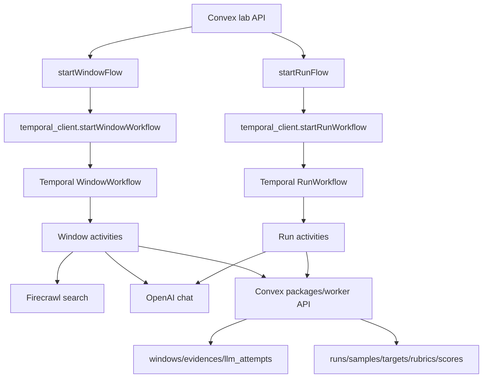

# judge-gym

An open-source LLM-as-Judge design space engine. judge-gym focuses on how rubric design, scoring models, scoring methods, and evidence presentation affect LLM evaluation of contested political concepts.

This README documents the **current implementation in `judge-gym/` only** and is intentionally self-contained. It does not assume features that exist only in `v0-old/` or `v1-target/`.

**Prerequisites**

- Node.js `>=22.12.0`
- Bun `>=1.1.27`

**Node version management (nvm)**
This repo pins Node via `.nvmrc` to keep all packages on the same version.

1. `nvm install 22.12.0`
2. `nvm use 22.12.0`
3. `nvm alias default 22.12.0`

**Validation routine**

- After Convex schema or function changes, run `bun run validate:convex` from the repo root.
- That routine runs `npx convex codegen` in `packages/engine-convex` and then the root TypeScript typecheck.

**JavaScript install flow**

- Use `bun install` from the repo root as the only supported JavaScript dependency install flow.
- Workspace packages should not keep independent npm lockfiles.

**Environment source of truth**

- The repo root `.env.local` is the source of truth for shared runtime configuration.
- Package-local env files are optional convenience copies only; the live package scripts now source the root `.env.local`.

**What exists today**

- Evidence windows are now started from the Convex engine and executed by a Temporal-owned `WindowWorkflow` with the same 3-stage LLM pipeline (clean → neutralize → abstract).
- The Temporal window path now persists workflow bindings on `windows`, stage-scoped attempt/error refs on `evidences`, and an append-only `llm_attempts` / `llm_attempt_payloads` ledger for prompt + response audit.
- Experiment runs are now also started from the Convex engine and executed by a Temporal-owned `RunWorkflow` across `rubric_gen`, `rubric_critic`, `score_gen`, and `score_critic`.
- The Temporal run path now persists workflow bindings on `runs`, per-stage attempt/error refs on `samples` and `sample_score_targets`, and writes run artifacts against the `llm_attempts` ledger instead of the legacy request queue.
- Window prompt policy now enforces strict L3 non-expansion with identity-prior abstraction by default (country/person/party/media tokens), while preserving governance structure, causality, and temporal anchors needed for claim interpretation.
- Rubric generation prompts now explicitly target partial-context evidence scoring (signal-strength framing, observable criteria, and explicit weak/mixed stages) to reduce avoidable abstain behavior on fragmentary articles.
- The V3 finish pass is now driven by the repo skill `skills/v3-finish-pass/` plus the campaign control plane under `_campaigns/v3_finish_pass/`.
- The current V3 cohort uses `scoring_config.evidence_bundle_size` as the only experiment-side bundle control (`1` = single evidence; `5` = the current bundle ablation), and the live `experiments` table is the config source of truth.
- The V3 cohort control plane now lives in:
  - `packages/codex:getV3CampaignStatus`
  - `packages/codex:resetRuns`
  - `packages/codex:startV3Experiments`
- The current ownDev pool-tag bindings are captured in `_campaigns/v3_finish_pass/manifest.json`:
  - `p1_us_contested_trial_2026_01_01`
  - `p2_no_election_reporting_control_2025_09_08`
- The current pre-reset forensic save state for the live V3 system audit is captured in `_blueprints/p1-p3-pre-nuke-final-audit/`, including the final bug ledger, evidence bundle, and prebuilt fix plan for the next clean deployment.
- Active experiment runs now patch persisted `runs.status` to `running` as soon as `rubric_gen` is enqueued, so live engine state matches actual in-flight work.
- Runs now persist both `target_count` and `completed_count`, plus per-stage completed counters (`rubric_gen_count`, `rubric_critic_count`, `score_gen_count`, `score_critic_count`) for live monitoring.
- Runs also support `pause_after`, which pauses the run after the requested stage settles instead of automatically enqueueing the next stage.
- Windows now persist both `target_count` and `completed_count`; `target_count` is the requested scrape cap from window creation, while `completed_count` tracks how many evidence rows actually reached `l3`.
- Experiments now persist `total_count`, which aggregates the `completed_count` of all runs for that experiment and powers the experiment-level completed total in the lab UI.
- Pools now persist `evidence_count`, which records the number of evidence rows frozen into the pool.
- Samples now persist `score_count` and `score_critic_count`, and score fanout is stored in generalized `sample_score_targets` / `sample_score_target_items` rows so both single-evidence and bundled-evidence runs share one scoring model.
- `getRunSummary`, `getExperimentSummary`, and `listExperiments` now expose `has_failures` and real per-stage failed counts, so partial-success runs remain `completed` but are visibly distinguishable from clean runs.
- Window and run execution now both launch through Temporal workflows; the legacy Convex scheduler/batch/job engine has been removed from the live schema and active code paths.
- The engine now exports full window/run/batch/job/request/scheduler telemetry best-effort to Axiom, while keeping only a tiny local `process_observability` mirror in Convex for the live debug loop.
- Score-stage payload building now preloads rubric/evidence/score documents per run stage to avoid repeated per-unit reads that could trigger Convex single-function read limits.
- Engine maintenance helpers now include targeted run cleanup (`deleteRunData`) and chunked table deletion (`nukeTableChunk`) for large-table recovery without read-limit failures.
- Targeted run cleanup (`deleteRunData`) now blocks active runs by default and requires an explicit `allow_active=true` override for destructive active-run deletion.
- Experiment-scoped run cleanup (`deleteExperimentRunData`) removes all run-scoped artifacts for one experiment while leaving windows, pools, and the experiment config intact.
- The engine includes a Bun telemetry checker (`bun run telemetry:check` in `packages/engine-convex`) to run an Axiom ingest smoke test through Convex.
- The engine now includes a codex live-debug surface (`packages/engine-convex/convex/domain/maintenance/process_debug.ts`) with Temporal-aware process health, local recent-event tailing, Axiom trace references, and bounded repair actions for run/window flows.
- `getProcessHealth` now derives live health from persisted run/window state, `process_observability`, and `llm_attempts` instead of the legacy request/batch snapshot tables.
- Run diagnostics now read run-scoped artifacts and `llm_attempts` directly, separating terminal failed targets from historical attempt failures and including a short failed-output preview for Temporal-owned forensics.
- Score-critic prompts now mirror the exact randomized rubric surface shown to `score_gen` (same identifiers, label hiding, and rubric order) instead of leaking decoded canonical stage labels back into the critic.
- Run prompts now use a structured XML-style prompt family with explicit task/requirements/output sections, and the score-stage prompts split evidence into the system prompt while passing rubric/verdict payloads in the user prompt.
- Non-abstain score prompts now use an explicit forced-choice fallback: if no stronger stage is supported, the model must emit the weakest displayed stage identifier instead of `None`, blank verdicts, or other out-of-contract text.
- System prompts are now deduplicated in `llm_prompt_templates`, and Temporal-owned execution references those templates through the append-only `llm_attempts` ledger.
- Codex maintenance/debug queries now use bounded scans (`take` caps) across large tables and the local `process_observability` mirror to prevent read-limit failures when historical telemetry/backlog is large.
- Codex health/stuck surfaces now flag `retryable_no_transport` and missing-workflow stalls directly from Temporal bindings, artifact state, and recent process projection freshness.
- `autoHealProcess` now executes bounded action pages (`cursor` + `max_actions`) and returns scan/action metadata, so large-backlog heals can run in resumable passes.
- Local telemetry diagnostics summarize the capped Convex recent-events mirror; the mirror now persists `external_trace_ref` plus truncated event payloads for local failure triage, while full event history lives in Axiom.
- The engine includes Bun live-debug commands in `packages/engine-convex`: `bun run debug:watch`, `bun run debug:stuck`, `bun run debug:heal`, and `bun run debug:tail`.
- The engine includes Bun process telemetry analysis in `packages/engine-convex`: `bun run debug:analyze --run <run_id>` / `--window <window_id>` for bounded, paginated trace diagnostics.
- Synthetic fault injection was used for temporary stress testing and is now removed from runtime settings. Historical matrix reports remain under `packages/engine-convex/docs/`.
- Convex engine tests include a full-run orchestration telemetry case for reproducing and verifying fixes for duplicate apply behavior.
- Experiment initialization now targets reusable evidence pools via `pool_id` + `pool_evidences`.
- The lab UI supports creating experiments, selecting evidence, and starting runs.
- Lab UI form controls (selects and date pickers) are Radix-based and wired through shadcn `FormControl`.
- Lab window form fields are composed from reusable input, calendar, and select components.
- Lab window editor syncs form state to URL params (debounced) and restores defaults on refresh.
- Lab experiment editor uses TanStack Form with server-parsed defaults and debounced URL param sync.
- Lab App Router editor pages resolve promise-based `searchParams` before deriving form defaults (Next 15 compatible typing).
- Lab experiment detail now fetches by route id directly (no list-first experiment fetch).
- `listEvidenceWindows` now aggregates evidence in one query pass instead of per-window lookups.

**What does not exist yet (in this repo)**

- An implementation of `data:exportExperimentBundle` used by the analysis client.
- A runtime override layer for `ENGINE_SETTINGS`.

---

## Repo Organization

**Top-level packages**
| Path | Role |
| --- | --- |
| `packages/engine-convex` | Convex backend: schema, domain state, lab APIs, Temporal start hooks, maintenance surfaces, and worker-facing write surfaces |
| `packages/engine-settings` | Pure shared config/constants package for queue names, env-key names, workflow contracts, and quota/runtime-agnostic defaults |
| `packages/lab` | Next.js app (UI for evidence windows + experiments) |
| `packages/engine-temporal` | Temporal worker package with live `WindowWorkflow` and `RunWorkflow` execution, local test harness, and Upstash-backed quota enforcement |
| `packages/analysis` | Python client for pulling experiment data from Convex |
| `paper.md` | Research framing |

**Local development**

- `bun dev` from the repo root starts the local UI and Convex development surfaces only (`packages/lab` + `packages/engine-convex`). The Temporal cluster and worker run on Railway in the primary dev path.
- `packages/engine-temporal` runs on a Node runtime, but dependencies are still installed through the root Bun workspace.
- When using Railway-hosted Temporal, the Convex deployment should point `TEMPORAL_ADDRESS` at the public TCP proxy for `temporal_server`, while the Railway-hosted `engine-temporal` worker should use the private service alias `temporalserver:7233`.
- The Railway worker deploy path for `packages/engine-temporal` builds from the repo root `Dockerfile`, which installs the Bun workspace and runs the Temporal worker from `packages/engine-temporal`.

**Engine internals (`packages/engine-convex/convex/`)**
| Path | Role |
| --- | --- |
| `domain/runs/` | Experiment creation + pool binding + run launch/reporting |
| `domain/temporal/` | Convex-side Temporal client/start helpers |
| `domain/window/` | Evidence window setup + search |
| `domain/maintenance/` | Debug, reset, and campaign control surfaces |
| `models/` | Zod schemas for tables and shared enums |
| `platform/` | Providers and shared provider metadata |
| `packages/` | Public Convex API surfaces (e.g. `lab.ts`, `worker.ts`) |
| `utils/` | Zod helpers, tags, and shared runtime helpers |
| `schema.ts` | Convex table definitions + indexes |

**Key submodules**
| Path | What it contains |
| --- | --- |
| `domain/runs/experiments_services.ts` | Experiment creation + pool binding |
| `domain/runs/experiments_repo.ts` | Experiment/pool storage + pool evidence binding |
| `domain/runs/run_service.ts` | Run lifecycle and Temporal launch/resume path |
| `domain/runs/run_repo.ts` | Run persistence and sample seeding at run creation |
| `domain/temporal/temporal_client.ts` | Convex-side Temporal workflow start actions for windows and runs |
| `domain/window/window_repo.ts` | Evidence search + insert + queries |
| `domain/window/evidence_search.ts` | Firecrawl-based news search |
| `domain/maintenance/process_debug.ts` | Temporal-aware health, stuck-work detection, and bounded repair helpers |
| `domain/maintenance/danger.ts` | Run-scoped destructive maintenance and table-prune helpers |
| `packages/worker.ts` | Narrow worker-facing Convex API for Temporal activities |
| `platform/providers/*` | OpenAI batch + chat integrations |
| `models/*` | Table schemas and shared enums |

---

## Data Model (Core Tables)

**Window execution tables**
| Table | Purpose | Key fields |
| --- | --- | --- |
| `windows` | Evidence window state | `status`, `current_stage`, `target_count`, `completed_count`, `model`, `query`, `country`, `start_date`, `end_date`, `workflow_id`, `workflow_run_id`, `last_error_message` |
| `evidences` | Evidence items for a window | `window_id`, `l0_raw_content`, `l1/l2/l3_*_content`, `l1/l2/l3_attempt_id`, `l1/l2/l3_error_message` |
| `llm_prompt_templates` | Deduplicated system prompt cache | `content_hash`, `content` |
| `llm_attempts` | Append-only worker-side LLM attempt ledger | `process_kind`, `process_id`, `target_type`, `target_id`, `stage`, `provider`, `model`, `workflow_id`, `status`, `started_at`, `finished_at`, `input_tokens`, `output_tokens`, `total_tokens` |
| `llm_attempt_payloads` | Prompt/output/error payload blobs for attempts | `attempt_id`, `kind`, `content_text`, `content_hash`, `byte_size`, `content_type` |
| `process_observability` | Local Temporal-era process observability mirror for debug surfaces and agent triage | `process_type`, `process_id`, `trace_id`, `last_*`, `recent_events`, `external_trace_ref` |

**Experiment and run tables (orchestrated)**
| Table | Purpose | Key fields |
| --- | --- | --- |
| `pools` | Reusable evidence pools | `pool_tag`, `evidence_count` |
| `pool_evidences` | Evidence membership for pools | `pool_id`, `evidence_id` |
| `experiments` | Experiment configs | `experiment_tag`, `pool_id`, `rubric_config`, `scoring_config`, `total_count` |
| `runs` | Run metadata | `status`, `experiment_id`, `current_stage`, `pause_after`, `target_count`, `completed_count`, per-stage completed counters, `workflow_id`, `workflow_run_id`, `last_error_message` |
| `samples` | Run samples (rubric scope + score aggregates) | `run_id`, `rubric_id`, `rubric_critic_id`, `seed`, `score_count`, `score_critic_count`, `rubric_gen_*`, `rubric_critic_*` |
| `sample_score_targets` | Frozen run score targets | `run_id`, `sample_id`, `score_id`, `score_critic_id`, `score_gen_*`, `score_critic_*` |
| `sample_score_target_items` | Evidence membership for each score target | `score_target_id`, `evidence_id`, `window_id`, `position` |
| `rubrics`, `scores`, `rubric_critics`, `score_critics` | LLM outputs | `llm_attempt_id`, parsed artifact payloads, and run/sample bindings |

**Indexes that drive orchestration**

- `llm_attempts.by_process`, `by_process_stage`, and `by_target` support Temporal window/run audit/debug lookups.
- `sample_score_targets.by_run` and `sample_score_target_items.by_score_target` support direct stage progress and deletion walks without queue-shaped snapshots.

---

## Orchestration Flow (End-to-End)

**High-level path**

1. A window is created via `window_repo.createWindow` with status `start` and stage `l0_raw`.
2. `startWindowFlow` starts a Temporal `windowWorkflow` through `domain/temporal/temporal_client.ts`, then binds the returned `workflow_id` / `workflow_run_id` onto the window through `packages/worker.ts`.
3. The Temporal worker runs the `collect` stage, calls Firecrawl search, and inserts `evidences` with `l0_raw_content` through the Convex worker API.
4. If search returns zero results, the worker marks the window `completed` with zero counts and halts the workflow cleanly.
5. For each transform stage (`l1_cleaned`, `l2_neutralized`, `l3_abstracted`), the worker lists pending evidence inputs, records a new `llm_attempt`, calls OpenAI chat, stores payloads, and applies the transformed content back onto the evidence row.
6. Stage failures are tracked per evidence row (`*_attempt_id`, `*_error_message`), and a stage that exhausts every pending item marks the whole window `error`.
7. The workflow projects snapshot state back into Convex as it advances, keeping `windows.status`, `current_stage`, and workflow bindings aligned with Temporal execution.

**Run flow (experiment)**

1. `initExperiment` creates an experiment that references a reusable pool (`pool_id`).
2. `startRunFlow` creates a run, seeds `samples` with zeroed `score_count` / `score_critic_count`, materializes `sample_score_targets` (+ `sample_score_target_items`) by stratifying the frozen pool by window and chunking it by `scoring_config.evidence_bundle_size`, then schedules a Temporal `runWorkflow`.
3. The Temporal worker lists prompt-ready stage inputs from the Convex worker API, records `llm_attempts`, calls OpenAI chat, and applies parsed artifacts back into `rubrics`, `rubric_critics`, `scores`, and `score_critics`.
4. Stage failures are tracked directly on `samples` and `sample_score_targets`, and stage finalization updates run counters, terminal status, and experiment totals without going through the legacy request queue.
5. `pause_after` is now enforced by the Temporal workflow shell itself, while Convex remains the source of truth for run state, artifacts, and reporting.

**Architecture overview**

```mermaid
flowchart TD
  Lab[Convex lab API] --> StartWindow[startWindowFlow]
  StartWindow --> TemporalStart[temporal_client.startWindowWorkflow]
  TemporalStart --> WindowWorkflow[Temporal WindowWorkflow]
  WindowWorkflow --> WindowActivities[Window activities]
  WindowActivities --> Firecrawl[Firecrawl search]
  WindowActivities --> OpenAI[OpenAI chat]
  WindowActivities --> WorkerApi[Convex packages/worker API]
  WorkerApi --> WindowTables[windows/evidences/llm_attempts]
  Lab --> StartRun[startRunFlow]
  StartRun --> RunTemporalStart[temporal_client.startRunWorkflow]
  RunTemporalStart --> RunWorkflow[Temporal RunWorkflow]
  RunWorkflow --> RunActivities[Run activities]
  RunActivities --> OpenAI
  RunActivities --> WorkerApi
  WorkerApi --> RunTables[runs/samples/targets/rubrics/scores]
```

Window and run execution are now Temporal-owned. The legacy Convex scheduler/batch/job path remains in the repo only until the old queue-based infrastructure is pruned.

## Provider Layer

**Provider actions**

- `submitOpenAiBatchAction` uploads a JSONL file and creates an OpenAI batch.
- `pollOpenAiBatchAction` polls the batch status and parses both output and error JSONL files.
- `openAiChatAction` uses the `ai` SDK to call OpenAI chat for job-mode requests.

**Provider configuration**

- `provider_types.ts` defines providers and model IDs.
- `OPENAI_API_KEY` is required for OpenAI calls.
- `FIRECRAWL_API_KEY` is required for evidence search.

---

## Known Gaps and Caveats

- `data:exportExperimentBundle` is referenced by the analysis client but not implemented here.
- `ENGINE_SETTINGS` are hardcoded and do not have a documented runtime override.
- Window and run execution are now split across Convex + Temporal; provider quota reservation/settlement is live for the OpenAI chat path, while broader provider-policy expansion is still in progress.
- `llm_attempt_payloads` currently store inline text in Convex rather than file-storage blobs.
- Temporal-window and Temporal-run quota enforcement currently lives in `packages/engine-temporal/src/quota/*` and talks directly to Upstash Redis from the worker runtime.
- For large active deployments, use the codex debug surface (`getProcessHealth`, `getStuckWork`, paged `autoHealProcess`) as the operational gate; Lab summary endpoints are reporting-oriented and not the primary live-heal path.
- `getProcessHealth.error_summary` is terminal-state oriented; use `historical_error_summary` and `getRunDiagnostics.failed_requests` when you need retry/attempt history rather than terminal truth.

---

## Key Files to Trace

- Window Temporal starter: `packages/engine-convex/convex/domain/temporal/temporal_client.ts`
- Window worker API: `packages/engine-convex/convex/packages/worker.ts`
- Window Temporal service: `packages/engine-temporal/src/window/service.ts`
- Window Temporal workflow: `packages/engine-temporal/src/workflows.ts`
- Run Temporal service: `packages/engine-temporal/src/run/service.ts`
- Run report/progress helpers: `packages/engine-convex/convex/domain/runs/run_progress.ts`, `experiments_data.ts`
- Process debug surface: `packages/engine-convex/convex/domain/maintenance/process_debug.ts`
- Destructive maintenance: `packages/engine-convex/convex/domain/maintenance/danger.ts`
- Quota layer: `packages/engine-temporal/src/quota/*`
- Provider calls: `packages/engine-convex/convex/platform/providers/*`
- Schema and models: `packages/engine-convex/convex/schema.ts`, `packages/engine-convex/convex/models/*`
