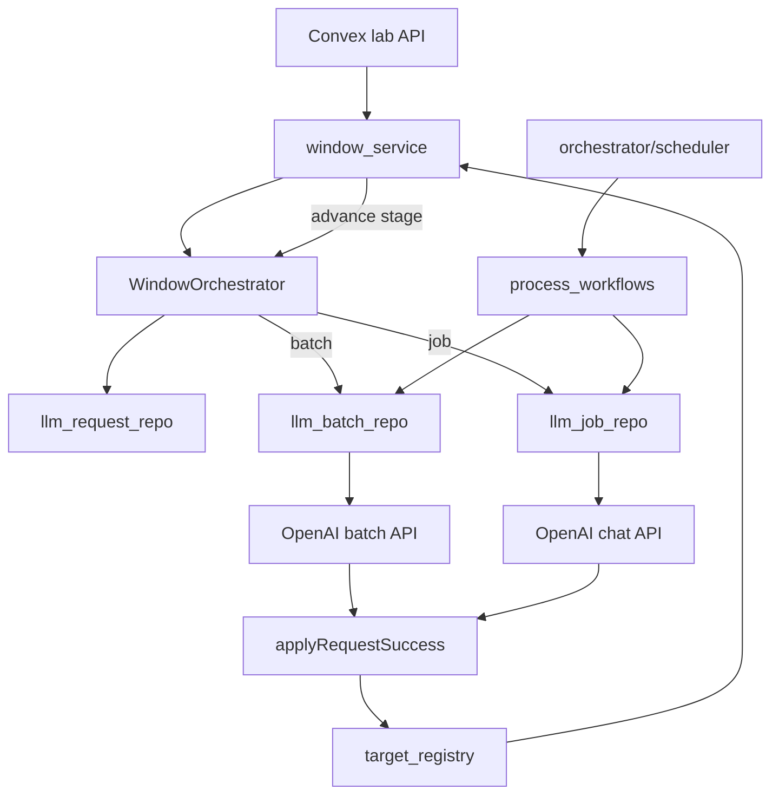
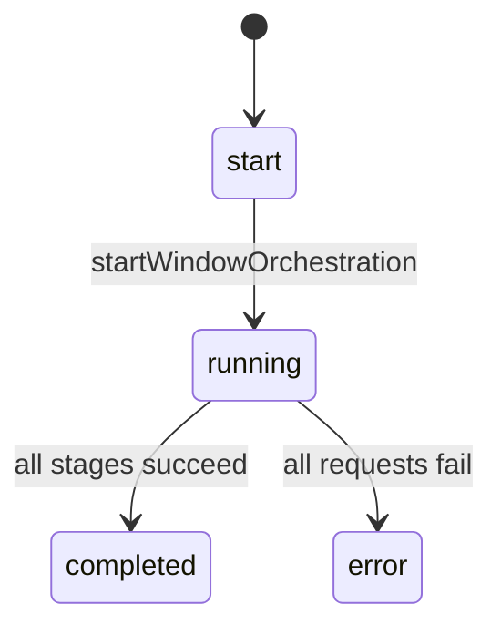
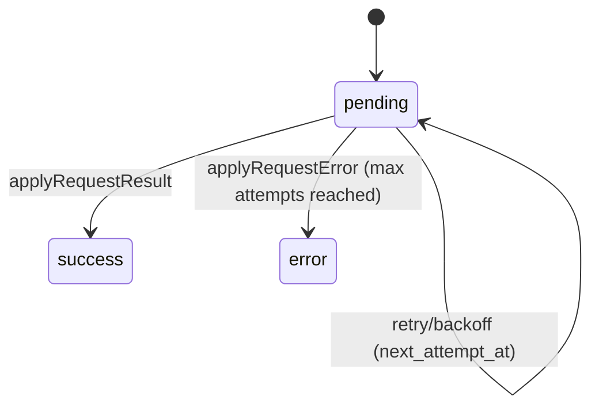
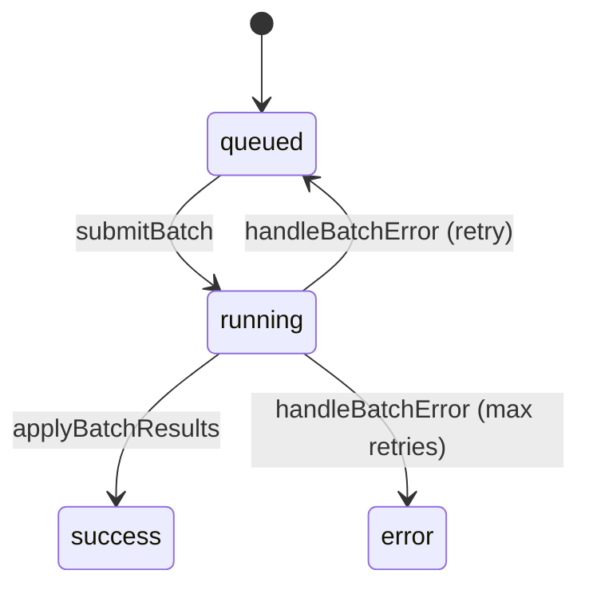
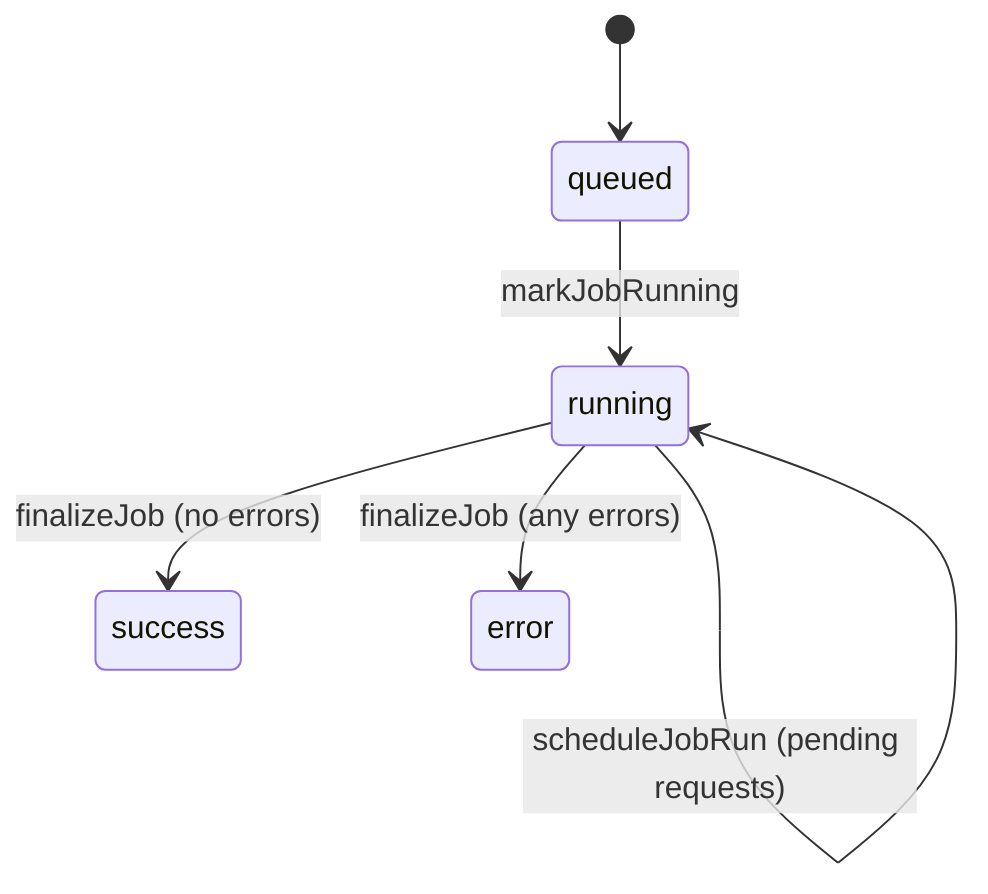

# judge-gym

An open-source LLM-as-Judge design space engine. judge-gym focuses on how rubric design, scoring models, scoring methods, and evidence presentation affect LLM evaluation of contested political concepts.

This README documents the **current implementation in `judge-gym/` only** and is intentionally self-contained. It does not assume features that exist only in `v0-old/` or `v1-target/`.

**Prerequisites**

- Node.js `>=22.12.0`
- Bun `>=1.1.27`

**Node version management (nvm)**
This repo pins Node via `.nvmrc` to keep all packages on the same version.

1. `nvm install 22.12.0`
2. `nvm use 22.12.0`
3. `nvm alias default 22.12.0`

**Validation routine**

- After Convex schema or function changes, run `bun run validate:convex` from the repo root.
- That routine runs `npx convex codegen` in `packages/engine-convex` and then the root TypeScript typecheck.

**JavaScript install flow**

- Use `bun install` from the repo root as the only supported JavaScript dependency install flow.
- Workspace packages should not keep independent npm lockfiles.

**Environment source of truth**

- The repo root `.env.local` is the source of truth for shared runtime configuration.
- Package-local env files are optional convenience copies only; the live package scripts now source the root `.env.local`.

**What exists today**

- Evidence windows are fully orchestrated in the Convex engine with a 3-stage LLM pipeline (clean → neutralize → abstract).
- Window prompt policy now enforces strict L3 non-expansion with identity-prior abstraction by default (country/person/party/media tokens), while preserving governance structure, causality, and temporal anchors needed for claim interpretation.
- Rubric generation prompts now explicitly target partial-context evidence scoring (signal-strength framing, observable criteria, and explicit weak/mixed stages) to reduce avoidable abstain behavior on fragmentary articles.
- The V3 finish pass is now driven by the repo skill `skills/v3-finish-pass/` plus the campaign control plane under `_campaigns/v3_finish_pass/`.
- The current V3 cohort uses `scoring_config.evidence_bundle_size` as the only experiment-side bundle control (`1` = single evidence; `5` = the current bundle ablation), and the live `experiments` table is the config source of truth.
- The V3 cohort control plane now lives in:
  - `packages/codex:getV3CampaignStatus`
  - `packages/codex:resetRuns`
  - `packages/codex:startV3Experiments`
- The current ownDev pool-tag bindings are captured in `_campaigns/v3_finish_pass/manifest.json`:
  - `p1_us_contested_trial_2026_01_01`
  - `p2_no_election_reporting_control_2025_09_08`
- The current pre-reset forensic save state for the live V3 system audit is captured in `_blueprints/p1-p3-pre-nuke-final-audit/`, including the final bug ledger, evidence bundle, and prebuilt fix plan for the next clean deployment.
- Active experiment runs now patch persisted `runs.status` to `running` as soon as `rubric_gen` is enqueued, so live engine state matches actual in-flight work.
- Runs now persist both `target_count` and `completed_count`, plus per-stage completed counters (`rubric_gen_count`, `rubric_critic_count`, `score_gen_count`, `score_critic_count`) for live monitoring.
- Runs also support `pause_after`, which pauses the run after the requested stage settles instead of automatically enqueueing the next stage.
- Windows now persist both `target_count` and `completed_count`; `target_count` is the requested scrape cap from window creation, while `completed_count` tracks how many evidence rows actually reached `l3`.
- Experiments now persist `total_count`, which aggregates the `completed_count` of all runs for that experiment and powers the experiment-level completed total in the lab UI.
- Pools now persist `evidence_count`, which records the number of evidence rows frozen into the pool.
- Samples now persist `score_count` and `score_critic_count`, and score fanout is stored in generalized `sample_score_targets` / `sample_score_target_items` rows so both single-evidence and bundled-evidence runs share one scoring model.
- `getRunSummary`, `getExperimentSummary`, and `listExperiments` now expose `has_failures` and real per-stage failed counts, so partial-success runs remain `completed` but are visibly distinguishable from clean runs.
- Ops now include a one-off `packages/codex:backfillRunCompletedCounts` mutation with dry-run + paging support to repair historical runs after the `completed_count` addition.
- Ops now also include `packages/codex:backfillWindowCompletedCounts` and `packages/codex:backfillPoolEvidenceCounts` to repair historical window/pool counts after those persisted fields are added.
- Ops now also include `packages/codex:backfillExperimentTotalCounts` to repair historical experiment aggregates after the `total_count` addition.
- Ops now also include `packages/codex:backfillSampleScoreCounts` to repair historical sample score aggregates and strip legacy sample score ID fields before their final schema removal.
- Run-stage reconcile now emits explicit reconcile outcomes (`run_stage_reconciled`) and can fail-safe pause a run (`status=paused`) when reconcile fails with no active transport left.
- The engine has a scheduler, batch/job orchestration, and rate limiting.
- Run-level experiment orchestration (rubric generation + scoring + critics) is implemented in the Convex engine.
- The engine now exports full window/run/batch/job/request/scheduler telemetry best-effort to Axiom, while keeping only a tiny local `process_observability` mirror in Convex for the live debug loop.
- Batch submission and polling now use lease-based claim locks (with a `finalizing` status during apply) to prevent duplicate provider batch calls and duplicate apply work across concurrent scheduler/workflow executions.
- Batch submit now uses a durable `submitting` phase with provider metadata lookup recovery, so unknown-outcome submit failures can recover the provider batch reference without blindly re-submitting.
- Scheduler/workflow batch polling now skips running batches that already have an active poll lease, reducing duplicate workflow starts and `batch_poll_claim_denied` churn during finalization.
- Scheduler ticks now auto-requeue due orphaned requests, so pending work without a job/batch owner no longer requires manual heal in the common case.
- Batch/job workflow leases now renew through long-running submit/run/apply sections, reducing duplicate execution after claim expiry on slow provider calls.
- OpenAI batch polling now treats terminal provider states such as `expired` and `cancelled` as errors instead of re-polling them forever.
- Orchestrator batch enqueue now enforces `run_policy.max_batch_size` by sharding large request sets across multiple `llm_batches` (default cap `100`), preventing oversized workflow completion payloads on large score stages.
- Batch-level retry handling now records failed `llm_requests` as immutable error rows and creates new retry request rows for subsequent attempts.
- Run parse failures now follow the same retry policy (new retry request rows + scheduler requeue) instead of immediately exhausting attempts, and run-stage pending-state checks are batched per stage to reduce per-target request lookups.
- Run-stage pending-state and stage-transition reconciliation now read from `process_request_targets` snapshots instead of global `llm_requests` status scans, reducing read-limit failures on large score-stage backlogs.
- Local `process_observability` mirroring now skips request-level noise; live health derives request failure state from `process_request_targets` instead of per-request event spam on the hot observability row.
- Stale `submitting` batches are now superseded when a sibling batch for the same `custom_key` already recovered or completed with a provider `batch_ref`.
- Successful request apply now reconciles the owning run stage immediately, so stages with exhausted residual requests do not remain stuck `running` after artifact state is already settled.
- `llm_batches` and `llm_jobs` now behave as append-only transport attempt logs: a failed attempt stays `error`, and the next retry creates a fresh row with the next `attempt_index`.
- Run trace ordering now emits request/job terminal events before `run_completed`, so terminal telemetry no longer includes post-terminal transport events.
- Score-stage payload building now preloads rubric/evidence/score documents per run stage to avoid repeated per-unit reads that could trigger Convex single-function read limits.
- Engine maintenance helpers now include targeted run cleanup (`deleteRunData`) and chunked table deletion (`nukeTableChunk`) for large-table recovery without read-limit failures.
- Targeted run cleanup (`deleteRunData`) now blocks active runs by default and requires an explicit `allow_active=true` override for destructive active-run deletion.
- Experiment-scoped run cleanup (`deleteExperimentRunData`) removes all run-scoped artifacts for one experiment while leaving windows, pools, and the experiment config intact.
- The engine includes a Bun telemetry checker (`bun run telemetry:check` in `packages/engine-convex`) to run an Axiom ingest smoke test through Convex.
- The engine now includes a codex live-debug surface (`packages/engine-convex/convex/maintenance/codex.ts`) with process health, local recent-event tailing, Axiom trace references, and safe auto-heal actions for run/window flows.
- `getProcessHealth` now uses persisted per-target request snapshots (`process_request_targets`) to avoid per-target request scans and stay reliable on high-cardinality runs/windows.
- `getProcessHealth` now returns `request_state_meta` (`approximate`, scanned target count, snapshot freshness) so operators can detect when health is in bounded/approximate mode.
- Run diagnostics now read run-scoped artifacts and requests via direct `run_id` indexes (`rubrics`, `rubric_critics`, `scores`, `score_critics`, `llm_requests`) instead of full-table artifact scans.
- Run diagnostics now separate historical failed attempts from terminal failed targets, and include a short failed-output preview for run-scoped request forensics.
- Score-critic prompts now mirror the exact randomized rubric surface shown to `score_gen` (same identifiers, label hiding, and rubric order) instead of leaking decoded canonical stage labels back into the critic.
- Run prompts now use a structured XML-style prompt family with explicit task/requirements/output sections, and the score-stage prompts split evidence into the system prompt while passing rubric/verdict payloads in the user prompt.
- Non-abstain score prompts now use an explicit forced-choice fallback: if no stronger stage is supported, the model must emit the weakest displayed stage identifier instead of `None`, blank verdicts, or other out-of-contract text.
- System prompts are now deduplicated in `llm_prompt_templates`, and `llm_requests` stores `system_prompt_id` instead of duplicating raw system prompt text on each attempt row.
- Codex maintenance/debug queries now use bounded scans (`take` caps) across large tables (including Convex system scheduled-function scans) to prevent read-limit failures when historical telemetry/backlog is large.
- Codex scheduler liveness checks now prefer `scheduler_locks` heartbeat state and use only a tiny best-effort `_scheduled_functions` fallback, which keeps `getProcessHealth` and `getStuckWork` stable after large scheduled-function history buildup.
- Codex health/stuck surfaces now explicitly flag `retryable_no_transport` stalls when a stage has retryable targets, no pending replacements, and no active batch/job transport; the scheduler also auto-requeues those stranded retryables during normal ticks.
- `autoHealProcess` now executes bounded action pages (`cursor` + `max_actions`) and returns scan/action metadata, so large-backlog heals can run in resumable passes.
- Local telemetry diagnostics summarize the capped Convex recent-events mirror; the mirror now persists `external_trace_ref` plus truncated event payloads for local failure triage, while full event history lives in Axiom.
- Window finalization now waits for zero in-flight transport work (queued/running/finalizing batch/job) before emitting `window_completed`, and workflow transport finalizers trigger an explicit stage reconcile pass so completion/error can finalize after the last job/batch closes.
- `startScheduler` now debounces repeated kickoff requests via `scheduler_locks` before falling back to the bounded `_scheduled_functions` scan, reducing duplicate-start contention during operator/manual nudges.
- The engine includes Bun live-debug commands in `packages/engine-convex`: `bun run debug:watch`, `bun run debug:stuck`, `bun run debug:heal`, and `bun run debug:tail`.
- The engine includes Bun process telemetry analysis in `packages/engine-convex`: `bun run debug:analyze --run <run_id>` / `--window <window_id>` for bounded, paginated trace diagnostics.
- The engine includes a synthetic matrix runner in `packages/engine-convex`: `bun run debug:matrix` (nuke-per-scenario, synthetic window/run setup, telemetry report output).
- Synthetic fault injection was used for temporary stress testing and is now removed from runtime settings. Historical matrix reports remain under `packages/engine-convex/docs/`.
- Convex engine tests include a full-run orchestration telemetry case for reproducing and verifying fixes for duplicate apply behavior.
- A new live E2E matrix test (`packages/engine-convex/convex/tests/live_e2e_matrix.test.ts`) drives production lab endpoints and reports run diagnostics + trace ordering.
- Experiment initialization now targets reusable evidence pools via `pool_id` + `pool_evidences`.
- The lab UI supports creating experiments, selecting evidence, and starting runs.
- Lab UI form controls (selects and date pickers) are Radix-based and wired through shadcn `FormControl`.
- Lab window form fields are composed from reusable input, calendar, and select components.
- Lab window editor syncs form state to URL params (debounced) and restores defaults on refresh.
- Lab experiment editor uses TanStack Form with server-parsed defaults and debounced URL param sync.
- Lab App Router editor pages resolve promise-based `searchParams` before deriving form defaults (Next 15 compatible typing).
- Lab experiment detail now fetches by route id directly (no list-first experiment fetch).
- `listEvidenceWindows` now aggregates evidence in one query pass instead of per-window lookups.

**What does not exist yet (in this repo)**

- An implementation of `data:exportExperimentBundle` used by the analysis client.
- A runtime override layer for `ENGINE_SETTINGS`.

---

## Repo Organization

**Top-level packages**
| Path | Role |
| --- | --- |
| `packages/engine-convex` | Convex backend: schema, orchestrators, scheduler, provider calls, rate limiting, data access |
| `packages/engine-settings` | Pure shared config/constants package for queue names, env-key names, workflow contracts, and quota/runtime-agnostic defaults |
| `packages/lab` | Next.js app (UI for evidence windows + experiments) |
| `packages/temporal-server` | Workspace wrapper that runs the local Temporal dev server |
| `packages/engine-temporal` | Temporal worker package with the greenfield `RunWorkflow` / `WindowWorkflow` skeleton, test harness, and Upstash quota scaffolding |
| `packages/analysis` | Python client for pulling experiment data from Convex |
| `paper.md` | Research framing |

**Local development**

- `bun dev` from the repo root starts all workspace `dev` processes, including the Temporal dev server in `packages/temporal-server` and the Temporal worker in `packages/engine-temporal`.
- The Temporal server persists local state to `packages/temporal-server/.temporal/dev.sqlite3` by default and serves the Web UI on `http://127.0.0.1:8233`.
- `packages/engine-temporal` runs on a Node runtime, but dependencies are still installed through the root Bun workspace.

**Engine internals (`packages/engine-convex/convex/`)**
| Path | Role |
| --- | --- |
| `domain/orchestrator/` | Scheduler, workflows, routing of LLM results |
| `domain/llm_calls/` | Batch/job/request repos + services |
| `domain/runs/` | Experiment creation + pool binding + run orchestration |
| `domain/window/` | Evidence window orchestration + search |
| `models/` | Zod schemas for tables and shared enums |
| `platform/` | Providers, rate limiter, run policy |
| `packages/` | Public Convex API surfaces (e.g. `lab.ts`) |
| `utils/` | Scheduling helpers, zod helpers, tags |
| `schema.ts` | Convex table definitions + indexes |

**Key submodules**
| Path | What it contains |
| --- | --- |
| `domain/orchestrator/base.ts` | Base orchestration logic + batch vs job decision |
| `domain/orchestrator/scheduler.ts` | Scheduler loop + requeue handling |
| `domain/orchestrator/process_workflows.ts` | Batch/job workflow state machine |
| `domain/orchestrator/target_registry.ts` | Custom key routing to domain handlers |
| `domain/llm_calls/*_repo.ts` | Batch/job/request storage mutations and queries |
| `domain/llm_calls/*_service.ts` | Rate limit checks, retries, apply results |
| `domain/runs/experiments_services.ts` | Experiment creation + pool binding |
| `domain/runs/experiments_repo.ts` | Experiment/pool storage + pool evidence binding |
| `domain/runs/run_orchestrator.ts` | Stage configs + pending/advance helpers + run prompt orchestration |
| `domain/runs/run_service.ts` | Run lifecycle, apply results, stage advancement |
| `domain/runs/run_repo.ts` | Run persistence and sample seeding at run creation |
| `domain/window/window_orchestrator.ts` | Stage configs + evidence-specific orchestration |
| `domain/window/window_service.ts` | Window lifecycle, apply results, stage advancement |
| `domain/window/window_repo.ts` | Evidence search + insert + queries |
| `domain/window/evidence_search.ts` | Firecrawl-based news search |
| `platform/providers/*` | OpenAI batch + chat integrations |
| `platform/rate_limiter/*` | Token bucket configs + rate limiter wiring |
| `models/*` | Table schemas and shared enums |
| `utils/scheduling.ts` | `getNextRunAt`, `getNextAttemptAt` helpers |

---

## Data Model (Core Tables)

**Orchestration tables**
| Table | Purpose | Key fields |
| --- | --- | --- |
| `windows` | Evidence window state | `status`, `current_stage`, `target_count`, `completed_count`, `model`, `query`, `country`, `start_date`, `end_date` |
| `evidences` | Evidence items for a window | `window_id`, `l0_raw_content`, `l1/l2/l3_*_content`, `l1/l2/l3_request_id` |
| `llm_prompt_templates` | Deduplicated system prompt cache | `content_hash`, `content` |
| `llm_requests` | Individual LLM call attempts | `status`, `run_id`, `model`, `custom_key`, `system_prompt_id`, `attempt_index`, `next_attempt_at`, `job_id`, `batch_id`, `last_error` |
| `process_request_targets` | Current per-target request snapshots used by debug health | `process_type`, `process_id`, `stage`, `custom_key`, `resolution`, `active_request_id`, `success_request_id`, `attempt_count`, `retry_count`, `latest_error_class` |
| `llm_jobs` | Non-batched request transport attempt log | `status`, `model`, `custom_key`, `attempt_index`, `next_run_at`, `last_error` |
| `llm_batches` | Batched request transport attempt log | `status`, `model`, `custom_key`, `batch_ref`, `attempt_index`, `next_poll_at`, `last_error` |
| `process_observability` | Small per-process local observability mirror for the live loop | `process_type`, `process_id`, `trace_id`, `last_*`, `recent_events`, `external_trace_ref` |
| `scheduler_locks` | Dedicated scheduler heartbeat/lock rows | `lock_key`, `status`, `heartbeat_ts_ms`, `expires_at_ms` |

**Experiment and run tables (orchestrated)**
| Table | Purpose | Key fields |
| --- | --- | --- |
| `pools` | Reusable evidence pools | `pool_tag`, `evidence_count` |
| `pool_evidences` | Evidence membership for pools | `pool_id`, `evidence_id` |
| `experiments` | Experiment configs | `experiment_tag`, `pool_id`, `rubric_config`, `scoring_config`, `total_count` |
| `runs` | Run metadata | `status`, `experiment_id`, `current_stage`, `pause_after`, `target_count`, `completed_count`, per-stage completed counters |
| `samples` | Run samples (rubric scope + score aggregates) | `run_id`, `rubric_id`, `rubric_critic_id`, `seed`, `score_count`, `score_critic_count` |
| `sample_score_targets` | Frozen run score targets | `run_id`, `sample_id`, `score_id`, `score_critic_id` |
| `sample_score_target_items` | Evidence membership for each score target | `score_target_id`, `evidence_id`, `window_id`, `position` |
| `rubrics`, `scores`, `rubric_critics`, `score_critics` | LLM outputs | LLM request IDs + metadata |

**Indexes that drive orchestration**

- `evidences.by_window_l1_pending`, `by_window_l2_pending`, `by_window_l3_pending` gate per-stage work.
- `llm_requests.by_orphaned` identifies pending requests without a batch or job.
- `llm_batches.by_status`, `llm_jobs.by_status` allow scheduler polling by status.

---

## Orchestration Flow (End-to-End)

**High-level path**

1. A window is created via `window_repo.createWindow` with status `start` and stage `l0_raw`.
2. `startWindowFlow` checks for existing evidence; if none exist, it runs `collectWindowEvidence`, calls `evidence_search.searchNews` (Firecrawl), and inserts evidence rows with `l0_raw_content`. Raw-collection provider failures now mark the window `status=error` at `l0_raw` and emit `window_collection_failed` instead of leaving the window in silent `scraping` limbo.
3. `startWindowOrchestration` sets the window to `running`, sets `current_stage` to `l1_cleaned`, and calls `WindowOrchestrator.enqueueStage`.
4. `WindowOrchestrator.enqueueStage` lists pending evidence for the stage using the stage-specific index.
5. The orchestrator builds prompts and creates one `llm_request` per evidence item.
6. The orchestrator records the request ID on the evidence row.
7. The orchestrator routes the request set to a **batch** or **job** based on the run policy.
8. The scheduler polls queued/running batches and jobs, starting workflows when `next_*` timestamps are due.
9. Workflows submit to the provider, poll for results, and apply outputs.
10. `applyRequestResult` updates the evidence output field and calls `maybeAdvanceWindowStage`.
11. `maybeAdvanceWindowStage` advances to the next stage or completes the window if all evidence items are done.

**Run flow (experiment)**

1. `initExperiment` creates an experiment that references a reusable pool (`pool_id`).
2. `startRunFlow` creates a run, seeds `samples` with zeroed `score_count` / `score_critic_count`, materializes `sample_score_targets` (+ `sample_score_target_items`) by stratifying the frozen pool by window and chunking it by `scoring_config.evidence_bundle_size`, and immediately patches the run to `status=running` with `current_stage=rubric_gen`. Optional `pause_after` lets operators stop a run after a chosen settled stage (for example after `rubric_critic`). `evidence_bundle_size=1` yields single-evidence scoring; `evidence_bundle_size=5` on the 20-item `P1` pool yields `4` score targets per sample.
3. `RunOrchestrator.enqueueStage` builds rubric prompts and creates LLM requests keyed by `sample:<id>:rubric_gen`.
4. Score-stage requests are keyed by score-target IDs (`sample_score_target:<id>:score_gen|score_critic`) so each sample can score either one evidence item or a frozen bundle of evidence items.
5. Results apply into `rubrics`, then `rubric_critics`, then `scores`, then `score_critics` across the four stages.
6. `maybeAdvanceRunStage` advances stages when every stage target is either completed or terminally failed (sample targets for rubric stages, sample-score-target targets for score stages), persists per-stage run counters as work lands, and respects `pause_after` before enqueueing the next stage. Sample `score_count` / `score_critic_count`, run `completed_count`, and experiment `total_count` persist as score work finishes.

**Architecture overview**

```mermaid
flowchart TD
  Lab[Convex lab API] --> WindowService[window_service]
  WindowService --> Orchestrator[WindowOrchestrator]
  Orchestrator --> Requests[llm_request_repo]
  Orchestrator -->|batch| Batches[llm_batch_repo]
  Orchestrator -->|job| Jobs[llm_job_repo]
  Scheduler[orchestrator/scheduler] --> Workflows[process_workflows]
  Workflows --> Batches
  Workflows --> Jobs
  Batches --> ProviderBatch[OpenAI batch API]
  Jobs --> ProviderChat[OpenAI chat API]
  ProviderBatch --> Results[applyBatchResults]
  ProviderChat --> Results[applyRequestSuccess]
  Results --> TargetRegistry[target_registry]
  TargetRegistry --> WindowService
  WindowService -->|advance stage| Orchestrator
```

---

## Decision Tree: Batch vs Job

**Where the decision is made**

- `BaseOrchestrator.decideRoute` chooses between batch and job.

**Decision logic**

1. If the model is not batchable → **job**.
2. If request count `< min_batch_size` → **job**.
3. Otherwise → **batch**.

**Policy sources**

- `ENGINE_SETTINGS.run_policy` defines `min_batch_size` and other limits.

---

## Custom Keys and Routing

Custom keys are how LLM results route back into domain handlers.

**Request keys**

- `WindowOrchestrator.makeRequestKey` formats request keys as `evidence:<evidence_id>:<stage>`.
- `RunOrchestrator.makeRequestKey` formats rubric-stage request keys as `sample:<sample_id>:<stage>`.
- `RunOrchestrator.makeRequestKey` formats score-stage request keys as `sample_score_target:<sample_score_target_id>:<stage>`.

**Process keys**

- `WindowOrchestrator.makeProcessKey` formats batch/job keys as `window:<window_id>:<stage>`.
- `RunOrchestrator.makeProcessKey` formats batch/job keys as `run:<run_id>:<stage>`.

**Routing**

- `target_registry` maps custom key prefixes to handlers.
- `evidence` routes are window-specific, and run-stage handlers support both `sample` and `sample_score_target` targets.

---

## Scheduler Mechanics

**Scheduler**

- `startScheduler` is idempotent; it only schedules a single `runScheduler` if one is not already pending.
- `runScheduler` loads queued/running batches and jobs, schedules bounded internal handlers when `next_*` timestamps are due, and reschedules itself after `poll_interval_ms`.
- If there are no queued/running batches or jobs (and no orphaned requests), `runScheduler` exits without rescheduling.
- During each tick, due orphaned requests are requeued through the target registry before the scheduler sleeps again.

**Important detail**

- Orphaned requests are detected and due requests are automatically requeued by the scheduler.

---

## Rate Limiting, Retries, and Backoff

**Rate limiting**

- Implemented with `@convex-dev/rate-limiter` using token buckets.
- Rate-limit tiers are defined per model in `platform/rate_limiter/provider_tiers.ts`.
- Batch and job rate-limit keys share the same config, with `batch_*` keys generated automatically.

**Batch flow**

1. `checkBatchRateLimit` checks the batch requests key for the model.
2. If rate limited, `next_poll_at` is pushed to the `retryAfter` time.
3. On completion, `applyBatchRateLimitUsage` charges input/output token buckets.
4. `handleBatchError` retries a batch up to `max_batch_retries`, then marks requests as error and triggers error handlers.

**Job flow**

1. `runJobRequests` processes due pending requests with bounded in-job concurrency (`run_policy.job_request_concurrency`) and checks request-level rate limits per request.
2. If rate limited, `next_attempt_at` is set to the limiter’s `retryAfter`.
3. Errors are retried up to `max_request_attempts`; beyond that, the request is marked error and routed to the error handler.

**Retry and backoff**

- `max_request_attempts` and `retry_backoff_ms` are enforced in both batch and job paths.
- Retryable requests that lose all active transport are requeued automatically by the scheduler; manual heal remains the fallback, not the primary recovery path.
- `getNextAttemptAt` and `getNextRunAt` derive from `ENGINE_SETTINGS.run_policy`.

---

## Run Policy Defaults

`ENGINE_SETTINGS.run_policy` governs batching, polling, retries, and token limits. These defaults are hardcoded in `packages/engine-convex/convex/settings.ts`.

| Policy field              | Default | Meaning                                                   | Enforced in                            |
| ------------------------- | ------- | --------------------------------------------------------- | -------------------------------------- |
| `poll_interval_ms`        | `20000` | Minimum time between scheduler polls                      | `scheduler.ts`, `utils/scheduling.ts`  |
| `max_batch_size`          | `100`   | Maximum requests per provider batch chunk                 | `BaseOrchestrator.createBatch`         |
| `min_batch_size`          | `25`    | Minimum requests needed to batch                          | `BaseOrchestrator.decideRoute`         |
| `max_tokens`              | `8000`  | Hard cap per request                                      | `llm_batch_service`, `llm_job_service` |
| `max_batch_retries`       | `2`     | Batch re-poll/retry cap                                   | `llm_batch_service`                    |
| `max_request_attempts`    | `3`     | Request retry cap                                         | `llm_batch_service`, `llm_job_service` |
| `retry_backoff_ms`        | `60000` | Backoff before retry                                      | `utils/scheduling.ts`                  |
| `job_request_concurrency` | `8`     | Max concurrent request executions per job processing tick | `llm_job_service`                      |

---

## State Machines

**Window lifecycle**

```mermaid
stateDiagram-v2
  [*] --> start
  start --> running: startWindowOrchestration
  running --> completed: all stages succeed
  running --> error: all requests fail
```

**LLM request lifecycle**

```mermaid
stateDiagram-v2
  [*] --> pending
  pending --> success: applyRequestResult
  pending --> error: applyRequestError (max attempts reached)
  pending --> pending: retry/backoff (next_attempt_at)
```

**Batch lifecycle**

```mermaid
stateDiagram-v2
  [*] --> queued
  queued --> running: submitBatch
  running --> success: applyBatchResults
  running --> queued: handleBatchError (retry)
  running --> error: handleBatchError (max retries)
```

**Job lifecycle**

```mermaid
stateDiagram-v2
  [*] --> queued
  queued --> running: markJobRunning
  running --> running: scheduleJobRun (pending requests)
  running --> success: finalizeJob (no errors)
  running --> error: finalizeJob (any errors)
```

---

## Provider Layer

**Provider actions**

- `submitOpenAiBatchAction` uploads a JSONL file and creates an OpenAI batch.
- `pollOpenAiBatchAction` polls the batch status and parses both output and error JSONL files.
- `openAiChatAction` uses the `ai` SDK to call OpenAI chat for job-mode requests.

**Provider configuration**

- `provider_types.ts` defines providers and model IDs.
- `OPENAI_API_KEY` is required for OpenAI calls.
- `FIRECRAWL_API_KEY` is required for evidence search.

---

## Known Gaps and Caveats

- `data:exportExperimentBundle` is referenced by the analysis client but not implemented here.
- `ENGINE_SETTINGS` are hardcoded and do not have a documented runtime override.
- For large active deployments, use the codex debug surface (`getProcessHealth`, `getStuckWork`, paged `autoHealProcess`) as the operational gate; Lab summary endpoints are reporting-oriented and not the primary live-heal path.
- Batch completion now treats missing per-request result rows as request errors/retries, preventing silent `pending` stalls.
- `getProcessHealth.error_summary` is terminal-state oriented; use `historical_error_summary` and `getRunDiagnostics.failed_requests` when you need retry/attempt history rather than terminal truth.

---

## Key Files to Trace

- Orchestration base: `packages/engine-convex/convex/domain/orchestrator/base.ts`
- Window orchestrator: `packages/engine-convex/convex/domain/window/window_orchestrator.ts`
- Window flow lifecycle: `packages/engine-convex/convex/domain/window/window_service.ts`
- Evidence search: `packages/engine-convex/convex/domain/window/evidence_search.ts`
- Scheduler: `packages/engine-convex/convex/domain/orchestrator/scheduler.ts`
- Workflows: `packages/engine-convex/convex/domain/orchestrator/process_workflows.ts`
- LLM services: `packages/engine-convex/convex/domain/llm_calls/llm_batch_service.ts`, `llm_job_service.ts`
- Rate limiting: `packages/engine-convex/convex/platform/rate_limiter/*`
- Provider calls: `packages/engine-convex/convex/platform/providers/*`
- Schema and models: `packages/engine-convex/convex/schema.ts`, `packages/engine-convex/convex/models/*`
