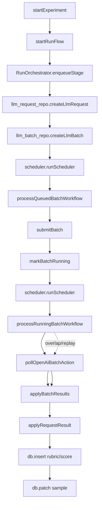
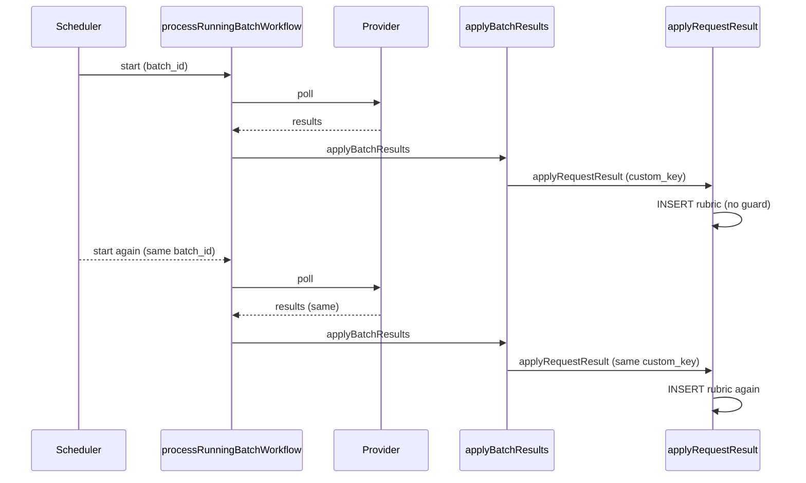

# Blueprint: Convex Idempotency Bug (Run → Batch → Apply)

> This blueprint isolates the root cause of duplicate rubric inserts when starting runs via `startExperiment`, and lays out a concrete, evidence-backed plan to fix it. The core issue is non-idempotent apply logic (`applyBatchResults` → `applyRequestResult`) combined with workflow replay/overlap and scheduler-triggered reprocessing.
>
> This document is a prebuilt implementation plan. Each step is meant to be executable by an agent, with explicit evidence to consult before acting.

---

## 0. Run Metadata

- **Run Folder:** `_blueprints/convex-idempotency-bug`
- **Research Question:** Investigate non-idempotent inserts in Convex workflow path when starting an experiment run (lab.ts startExperiment). Trace code paths, isolate bug, and propose fixes.
- **Scope:** run start → orchestrator enqueue → batch workflows → apply results → rubric inserts
- **Non-goals:** unrelated experiment UX, non-batch execution paths unless they share apply logic
- **Constraints:** do not implement changes in this phase; produce a fix plan and diagnostics

---

## 1. Worldview Register (Single Source of Truth)

`worldview.json` is the registry for subagent assignments, evidence, and synthesis status.

- **Agent Registry:** lead, researchers, falsifier, certainty scorer, synthesizer
- **Assignments:** Areas of Analysis and assigned subagents
- **Evidence Registry:** `knowledge/k_...md`
- **Hypotheses Registry:** `hypotheses/hyp_...json`
- **Null Challenges:** `null_challenges/nc_...json`
- **Certainty Report:** `certainty/certainty_report.md`

---

## 2. Evidence Ledger (Grounding)

- `k_001_start_experiment_flow.md`: startExperiment → startRunFlow → scheduler start. Establishes entry path. 
- `k_002_enqueue_stage_batching.md`: enqueueStage creates `llm_requests` and routes to `llm_batches` or `llm_jobs`.
- `k_003_scheduler_and_running_batch.md`: scheduler starts batch workflows each poll; running batch applies results.
- `k_004_apply_results_not_idempotent.md`: applyBatchResults calls applyRequestResult without idempotency guard; applyRequestResult always inserts.
- `k_005_workflow_replay_and_retry.md`: workflow handler replay and action retries can re-execute steps.
- `k_006_batch_retry_creates_requests.md`: batch error path creates new requests with same custom_key.

**Critical gaps:**
- Confirm via logs how often `processRunningBatchWorkflow` is invoked per batch.
- Confirm duplicate `applyRequestResult` calls per `custom_key`.

---

## 3. Areas of Analysis

| Area ID | Scope | Assigned Subagent | Evidence IDs |
| :------ | :---- | :---------------- | :---------- |
| A_orchestrator | Run and orchestrator path from startExperiment | 019c960f-6df9-7831-9fdb-67ee9a6f1543 | k_001, k_002 |
| A_scheduler | Scheduler + batch workflow execution | 019c960f-937a-7b31-ae5c-d0cec977b360 | k_003, k_006 |
| A_workflow | Workflow/workpool semantics | 019c960f-849d-7563-a4c4-1a4230202c60 | k_005 |

---

## 4. Micro-Hypotheses

| Hypothesis ID | Statement | Evidence | Confidence |
| :------------ | :-------- | :------- | :--------- |
| h_orch_001 | Duplicate rubric inserts are caused by non-idempotent apply logic that inserts on repeated apply calls. | k_004 | 0.70 |
| h_sched_001 | Scheduler starts overlapping running-batch workflows for the same batch, causing re-apply. | k_003 | 0.60 |
| h_wf_001 | Workflow replay + action retries increase repeated polling and re-apply risk. | k_005 | 0.55 |

---

## 5. Null Challenge Summary

| Hypothesis ID | Outcome | Key Disconfirming Evidence |
| :------------ | :------ | :------------------------- |
| h_orch_001 | Passed | k_004 |
| h_sched_001 | Passed | k_003 |
| h_wf_001 | Mixed | k_005 |

---

## 6. Certainty Scoring Summary

- **Method:** Isolated certainty scorer reviews evidence and steps.
- **Report:** `certainty/certainty_report.md`
- **Lowest-confidence items:** H_wf_001 (retry impact magnitude), S4 (locking strategy tradeoffs)

---

## 7. Prebuilt Implementation Plan

### System Diagram (Observed Flow)

### Failure Surface (Duplicate Apply)

### Step Template

- **Step ID / Name:** [e.g., S1: Instrument Duplicate Apply]
- **Objective:** [What this step achieves]
- **Evidence to Review:** [k_...]
- **Inputs:** [Files, configs, dependencies]
- **Actions:**
  1. [Concrete action]
- **Outputs:** [New files, updated records]
- **Verification:** [Tests, checks, or acceptance criteria]
- **Risks/Assumptions:** [What could invalidate this step]
- **Confidence:** [0.0-1.0]

### Steps

#### S1: Add Diagnostic Telemetry for Duplicate Applies

- **Objective:** Prove how many times `applyRequestResult` is invoked per `custom_key` and per batch.
- **Evidence to Review:** k_003, k_004, k_005
- **Inputs:** `packages/engine/convex/domain/llm_calls/llm_batch_service.ts`, `packages/engine/convex/domain/runs/run_service.ts`
- **Actions:**
  1. Add structured logging around `applyBatchResults` and `applyRequestResult` (batch_id, request_id, custom_key, stage, sample_id).
  2. Log `req.status` at apply time and count distinct `llm_request` rows per `custom_key`.
- **Outputs:** Log traces or metrics confirming repeated apply calls.
- **Verification:** Logs show >1 apply call for same custom_key in a single run.
- **Risks/Assumptions:** Logging volume is acceptable.
- **Confidence:** 0.65

#### S2: Add Idempotency Guards at Apply Site (Low-risk Fix)

- **Objective:** Prevent duplicate inserts even if workflows replay or overlap.
- **Evidence to Review:** k_004, k_006
- **Inputs:** `packages/engine/convex/domain/runs/run_service.ts`, `packages/engine/convex/domain/llm_calls/llm_batch_service.ts`
- **Actions:**
  1. In `applyBatchResults`, skip applying results if `req.status !== "pending"`.
  2. In `applyRequestResult`, early-return if the sample already has the stage output (`rubric_id`, `score_id`, etc.), but still mark the request `success`.
- **Outputs:** Idempotent behavior under duplicates; no extra rubric inserts.
- **Verification:** Re-running `processRunningBatchWorkflow` produces no new rubrics for a completed batch.
- **Risks/Assumptions:** Must ensure request status transitions stay consistent.
- **Confidence:** 0.72

#### S3: Add Request-Level Idempotency Marker (Stronger Guard)

- **Objective:** Make apply idempotent at the `llm_request` level even if sample output is null.
- **Evidence to Review:** k_004, k_006
- **Inputs:** `llm_requests` schema + `applyRequestResult`
- **Actions:**
  1. Add `applied_at` or `applied_request_id` to `llm_requests`.
  2. On apply, set the marker; skip if already set.
- **Outputs:** A single source of truth for applied results.
- **Verification:** Multiple apply calls no-op after first.
- **Risks/Assumptions:** Requires schema change; may need backfill.
- **Confidence:** 0.60

#### S4: Prevent Overlapping Running-Batch Workflows (Structural Fix)

- **Objective:** Ensure only one running-batch workflow can process a batch at a time.
- **Evidence to Review:** k_003
- **Inputs:** `packages/engine/convex/domain/orchestrator/scheduler.ts`, `packages/engine/convex/domain/orchestrator/process_workflows.ts`
- **Actions:**
  1. At workflow start, atomically patch `batch.next_poll_at` forward (or set `status: polling`), then check it in scheduler.
  2. Use compare-and-swap patterns to avoid two workflows polling simultaneously.
- **Outputs:** Reduced duplicate polling and apply.
- **Verification:** Only one running workflow per batch_id in a time window.
- **Risks/Assumptions:** Must not block legitimate retries or error recovery.
- **Confidence:** 0.52

#### S5: Add Test Coverage for Idempotency

- **Objective:** Prevent regressions by encoding duplicate-apply scenarios.
- **Evidence to Review:** k_004, k_005
- **Inputs:** `packages/engine/convex/tests/orchestrator_workflows.test.ts`
- **Actions:**
  1. Add a test that runs `applyBatchResults` twice with the same results and asserts no duplicate rubrics.
  2. Add a test that starts two running-batch workflows for the same batch and asserts single output.
- **Outputs:** Test coverage for idempotent behavior.
- **Verification:** Tests pass with idempotency guards; fail without.
- **Risks/Assumptions:** Requires ability to simulate workflow steps reliably.
- **Confidence:** 0.58

---

## 8. Validation Gates

1. **Evidence Sufficiency Gate:** Each step cites at least one evidence item.
2. **Conflict Gate:** Hypothesis conflicts resolved or explicitly deferred.
3. **Null Challenge Gate:** No critical hypothesis remains unchallenged.
4. **Verification Gate:** Every step has a checkable outcome.

---

## 9. Open Questions

- How frequently do running-batch workflows overlap for the same batch in production?
- Are duplicate applies happening due to scheduler overlap, action retries, or batch retry logic (new requests with same custom_key)?
- Should idempotency be enforced at the request, sample, or batch level?

---

## Appendix: Sources

- `packages/engine/convex/packages/lab.ts`
- `packages/engine/convex/domain/runs/run_service.ts`
- `packages/engine/convex/domain/orchestrator/base.ts`
- `packages/engine/convex/domain/orchestrator/scheduler.ts`
- `packages/engine/convex/domain/orchestrator/process_workflows.ts`
- `packages/engine/convex/domain/llm_calls/llm_batch_service.ts`
- `packages/engine/node_modules/@convex-dev/workflow/src/client/workflowMutation.ts`
- `packages/engine/node_modules/@convex-dev/workflow/src/component/journal.ts`
- `packages/engine/node_modules/@convex-dev/workflow/src/component/pool.ts`
