# judge-gym: System Architecture

> **Last updated:** March 2026  
> **Stack:** Turborepo · Bun · TypeScript · Convex · Temporal · Redis · OpenAI · Firecrawl · Next.js · Python/uv

---

## Table of Contents

1. [Overview](#overview)
2. [Monorepo Layout](#monorepo-layout)
3. [High-Level Architecture](#high-level-architecture)
4. [Component Deep-Dives](#component-deep-dives)
   - [engine-convex (Convex Backend)](#engine-convex-convex-backend)
   - [engine-temporal (Temporal Worker)](#engine-temporal-temporal-worker)
   - [engine-settings (Shared Config)](#engine-settings-shared-config)
   - [engine-prompts (Prompt Builders)](#engine-prompts-prompt-builders)
   - [lab (Next.js Frontend)](#lab-nextjs-frontend)
   - [analysis (Python)](#analysis-python)
5. [Data Model](#data-model)
6. [Pipeline Flows](#pipeline-flows)
   - [Window Pipeline (Evidence Collection)](#window-pipeline-evidence-collection)
   - [Run Pipeline (LLM-as-Judge Scoring)](#run-pipeline-llm-as-judge-scoring)
7. [Infrastructure](#infrastructure)
   - [Temporal (Workflow Orchestration)](#temporal-workflow-orchestration)
   - [Convex (Database + Serverless Functions)](#convex-database--serverless-functions)
   - [Redis (Quota / Rate Limiting)](#redis-quota--rate-limiting)
   - [Firecrawl (Web Search + Scraping)](#firecrawl-web-search--scraping)
   - [OpenAI (LLM Inference)](#openai-llm-inference)
   - [Axiom (Telemetry)](#axiom-telemetry)
8. [Control Plane](#control-plane)
9. [Key Design Decisions](#key-design-decisions)

---

## Overview

judge-gym is an open-source **LLM-as-Judge design-space engine** — a research platform for systematically exploring how different configurations of language-model judges (model choice, rubric design, evidence presentation, randomization strategies) affect scoring behavior.

The system:

1. **Collects evidence** — scrapes and semantically transforms news articles across configurable windows (date range, country, topic).
2. **Runs judge experiments** — for each experiment configuration, generates rubrics via LLM, critiques them, scores evidence bundles, and critiques scores.
3. **Stores a complete audit trail** — every LLM call, every prompt, every parsed output, every stage transition is durably stored.
4. **Analyzes results** — exports structured data to Python for JSD, DST, and OLS analyses.

---

## Monorepo Layout

```
judge-gym/
├── apps/
│   ├── engine-convex/       Convex serverless backend (schema, functions, domain logic)
│   ├── engine-temporal/     Temporal worker (workflow + activity execution)
│   ├── lab/                 Next.js 15 frontend (UI for experiment management)
│   └── analysis/            Python/Jupyter statistical analysis
├── packages/
│   ├── engine-settings/     Shared runtime-agnostic config, types, constants
│   └── engine-prompts/      Shared prompt builders and experiment config types
├── _campaigns/              Machine-readable campaign manifests and live agent state
├── _blueprints/             Architecture research blueprints
├── docs/                    Documentation (this file, pilot notes, etc.)
├── scripts/                 Shell helpers: deploy, Railway env, dev wrapper
├── Dockerfile               Multi-stage build for engine-temporal on Railway
├── railway.toml             Railway deployment config
└── turbo.json               Turborepo pipeline (build, typecheck, test, dev)
```

**Package manager:** `bun` (workspace-aware)  
**Node requirement:** ≥ 22.12.0

---

## High-Level Architecture

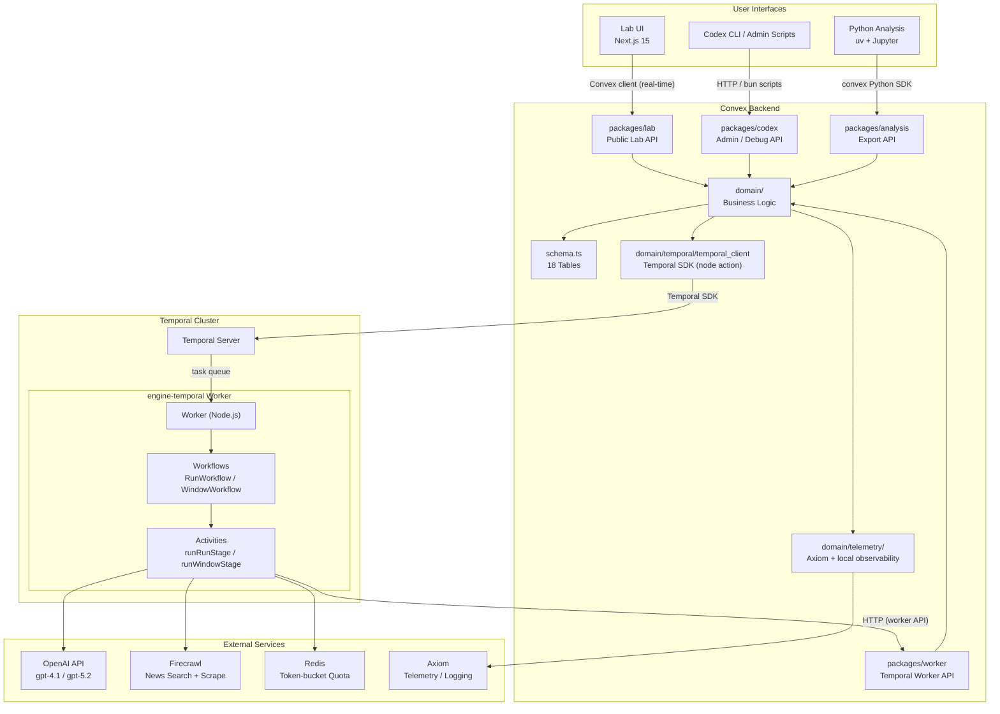

---

## Component Deep-Dives

### engine-convex (Convex Backend)

The backbone of the system. Convex provides the **serverless database, function runtime, and real-time subscriptions** for all persistent state.

#### API Surface (`convex/packages/`)

Three distinct API packages gate all external access:

| Package                | Consumer           | Purpose                                                                      |
| ---------------------- | ------------------ | ---------------------------------------------------------------------------- |
| `packages/lab.ts`      | Lab UI (Next.js)   | Window/experiment/run management, evidence browsing, telemetry               |
| `packages/worker.ts`   | engine-temporal    | Workflow binding, stage input queries, result application, attempt recording |
| `packages/codex.ts`    | CLI / Codex agents | Admin control, debug, process inspection, campaign management                |
| `packages/analysis.ts` | Python analysis    | Paginated data export                                                        |

#### Domain Layer (`convex/domain/`)

All business logic lives here, called only from the API packages:

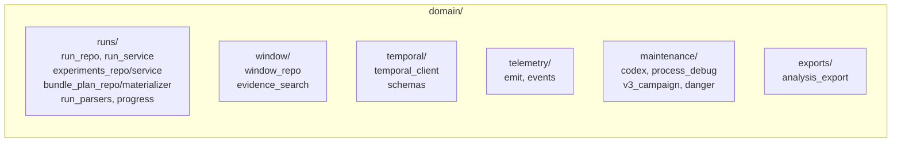

#### Function Style

All Convex functions use Zod-wrapped helpers from `utils/custom_fns.ts`:

```typescript
// Public functions
export const { zMutation, zQuery, zAction };
// Internal (cross-function calls only)
export const { zInternalMutation, zInternalQuery, zInternalAction };
```

Functions define typed `args` (Zod schemas) and explicit `returns` validators.

---

### engine-temporal (Temporal Worker)

The execution engine. Runs as a **long-lived Node.js process** (Docker container on Railway), connected to Temporal Server via gRPC.

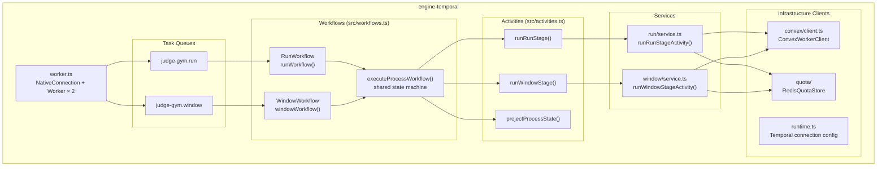

#### Workflow State Machine

Both `RunWorkflow` and `WindowWorkflow` run through the shared `executeProcessWorkflow<TStage>()`:

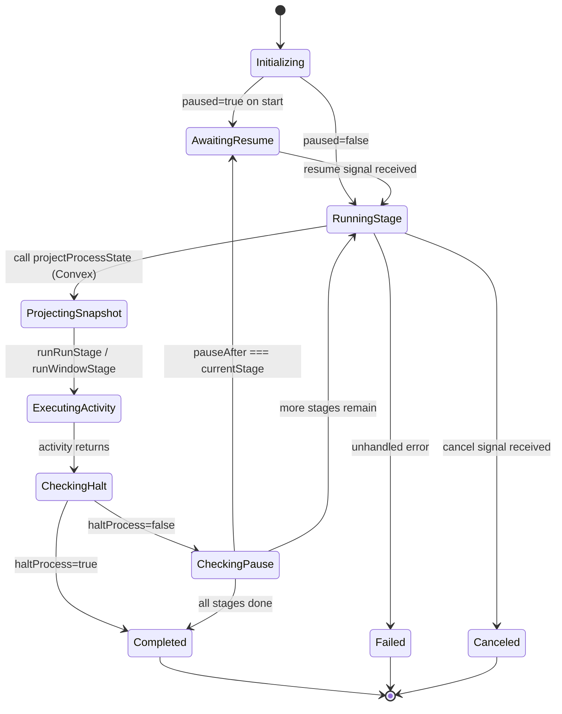

#### Control Handlers (Temporal Signals / Updates)

| Handler              | Type   | Effect                                                                 |
| -------------------- | ------ | ---------------------------------------------------------------------- |
| `getProcessSnapshot` | Query  | Returns current `ProcessSnapshot`                                      |
| `setPauseAfter`      | Update | Sets `snapshot.pauseAfter` to a stage name                             |
| `pauseNow`           | Update | Immediately sets `paused = true`                                       |
| `resume`             | Update | Unblocks `awaitResume()` condition                                     |
| `repairBounded`      | Update | Supports `reproject_snapshot`, `resume_if_paused`, `clear_pause_after` |

---

### engine-settings (Shared Config)

Runtime-agnostic package consumed by both `engine-convex` and `engine-temporal`. Contains no runtime-specific code — pure types, constants, and schema resolvers.

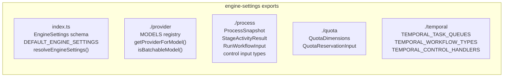

**Models:**

| ID             | Provider Model            | Batchable |
| -------------- | ------------------------- | --------- |
| `gpt-4.1`      | `gpt-4.1-2025-04-14`      | Yes       |
| `gpt-4.1-mini` | `gpt-4.1-mini-2025-04-14` | Yes       |
| `gpt-5.2`      | `gpt-5.2-2025-12-11`      | Yes       |
| `gpt-5.2-chat` | `gpt-5.2-chat-latest`     | No        |

**Task Queues:**

- `judge-gym.run` — for run workflows
- `judge-gym.window` — for window workflows

---

### engine-prompts (Prompt Builders)

Shared prompt construction logic. Produces `{ system_prompt, user_prompt }` pairs used by both the Convex backend (when assembling `listRunStageInputs`) and the Temporal worker (window stage prompts).

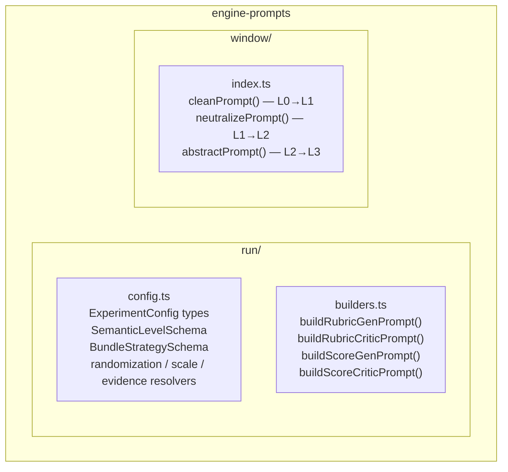

**LLM output contracts (parsed by `run_parsers.ts`):**

| Stage           | Required output token                                  |
| --------------- | ------------------------------------------------------ |
| `rubric_gen`    | `RUBRIC: <xml block>`                                  |
| `rubric_critic` | `QUALITY: observability=<0-1>, discriminability=<0-1>` |
| `score_gen`     | `VERDICT: <identifier>` (or `ABSTAIN`)                 |
| `score_critic`  | `EXPERT_AGREEMENT: <0-1>`                              |

---

### lab (Next.js Frontend)

**Next.js 15 + React 19** UI. Uses the Convex real-time client for live-updating queries.

**Routes:**

| Route                | Purpose                                                               |
| -------------------- | --------------------------------------------------------------------- |
| `/`                  | Home / landing                                                        |
| `/editor/window`     | Create and configure evidence collection windows                      |
| `/editor/experiment` | Configure experiments (pool selection, rubric config, scoring config) |
| `/experiment/[id]`   | Experiment detail — runs, progress, score targets                     |
| `/evidence/[id]`     | Evidence detail — all semantic levels (L0–L3) side by side            |

**Key libraries:** Radix UI, TanStack Form, date-fns, react-day-picker, sonner (toasts), lucide-react, next-themes.

---

### analysis (Python)

Post-run statistical analysis. Reads data from Convex via the `packages/analysis` API using the Convex Python SDK.

**Analyses:**

- **JSD (Jensen-Shannon Divergence)** — measures polarization of score distributions across experimental conditions
- **DST (Dempster-Shafer Theory)** — belief aggregation across multiple independent scorers
- **OLS Regression** — models relationships between experimental conditions (model, randomization, abstain, etc.) and scoring outcomes

**Dependencies:** `numpy`, `pandas`, `scipy`, `scikit-learn`, `statsmodels`, `matplotlib`, `seaborn`, `py-dempster-shafer`, `sentence-transformers`

---

## Data Model

18 Convex tables organized across four domains:

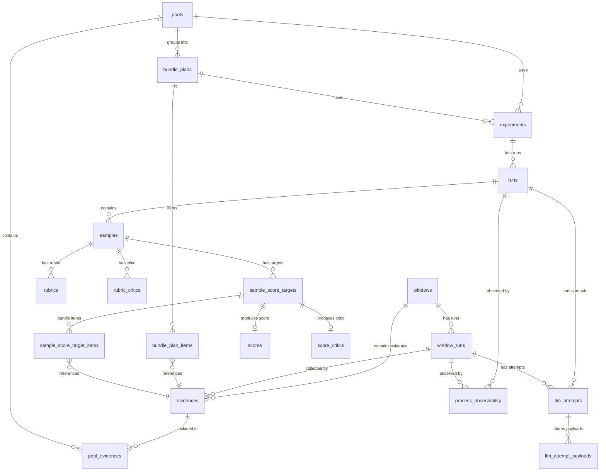

### Table Summary

**Evidence domain:**

| Table            | Description                                                     |
| ---------------- | --------------------------------------------------------------- |
| `windows`        | A search window: date range, country, topic query               |
| `window_runs`    | One execution pass over a window; tracks current semantic stage |
| `evidences`      | One scraped article with all 4 semantic levels (L0–L3)          |
| `pools`          | Named collection of evidence for experiments                    |
| `pool_evidences` | Many-to-many join: pool ↔ evidence                              |

**Experiment design domain:**

| Table               | Description                                                     |
| ------------------- | --------------------------------------------------------------- |
| `bundle_plans`      | Strategy for grouping pool evidence into scoring bundles        |
| `bundle_plan_items` | Individual evidence slots within a bundle plan                  |
| `experiments`       | Full experimental configuration: rubric config + scoring config |

**Run execution domain:**

| Table                       | Description                                                         |
| --------------------------- | ------------------------------------------------------------------- |
| `runs`                      | One execution of an experiment; tracks stage progress               |
| `samples`                   | One (sample × model) unit within a run                              |
| `rubrics`                   | LLM-generated rubric for a sample                                   |
| `rubric_critics`            | Quality audit of a rubric (observability + discriminability scores) |
| `sample_score_targets`      | One (sample × evidence bundle) scoring slot                         |
| `sample_score_target_items` | Evidence items in a scoring bundle                                  |
| `scores`                    | LLM verdict for a score target                                      |
| `score_critics`             | Expert agreement probability for a score                            |

**Audit / telemetry domain:**

| Table                   | Description                                                   |
| ----------------------- | ------------------------------------------------------------- |
| `llm_attempts`          | Full audit record for every LLM call (tokens, timing, status) |
| `llm_attempt_payloads`  | Stored prompt and response payloads (chunked by kind)         |
| `process_observability` | Local mirror of Axiom telemetry events per workflow           |

---

## Pipeline Flows

### Window Pipeline (Evidence Collection)

Transforms raw web search results into semantically layered evidence.

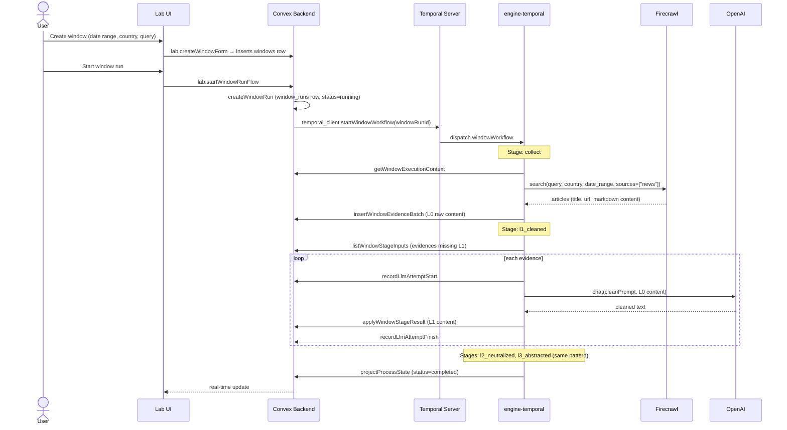

**Semantic levels:**

| Level | Name          | Description                                                                  |
| ----- | ------------- | ---------------------------------------------------------------------------- |
| L0    | `raw`         | Original scraped markdown content                                            |
| L1    | `cleaned`     | Page chrome removed, article content preserved verbatim                      |
| L2    | `neutralized` | Rhetoric reduced, factual claim graph preserved                              |
| L3    | `abstracted`  | Named entities replaced with role tokens (EXECUTIVE_LEADER, COUNTRY_A, etc.) |

---

### Run Pipeline (LLM-as-Judge Scoring)

Executes a complete judge experiment across N samples.

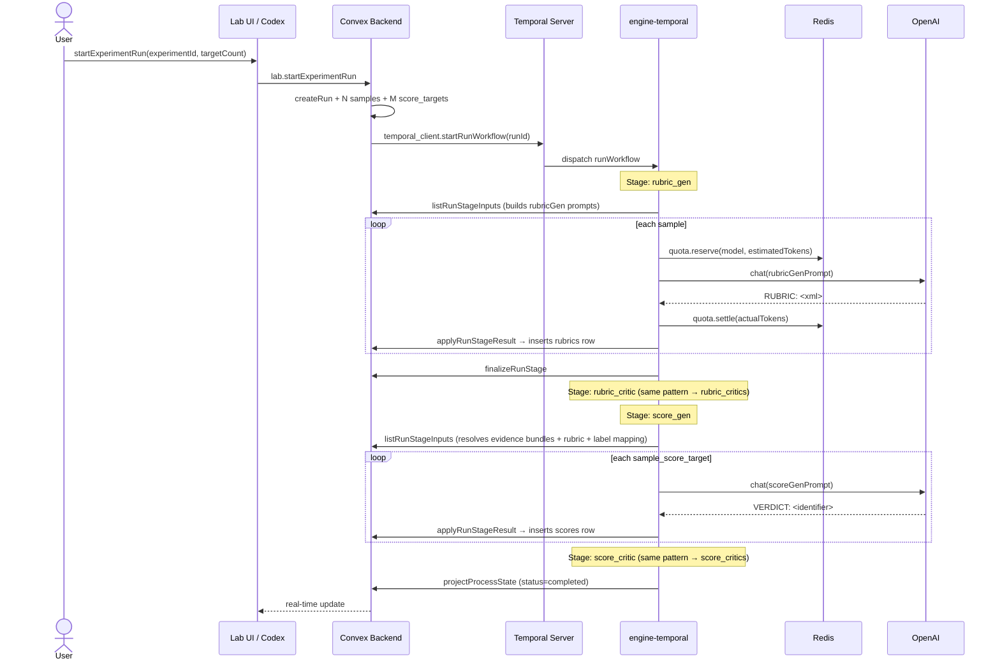

**Stage dependencies and failure propagation:**

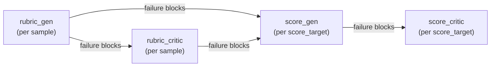

If any stage fails for a given sample/target, all downstream stages are immediately marked as `blocked`, preventing orphaned pending work.

---

## Infrastructure

### Temporal (Workflow Orchestration)

Temporal provides **durable, pauseable, resumeable workflow execution**. It is the backbone of the execution plane.

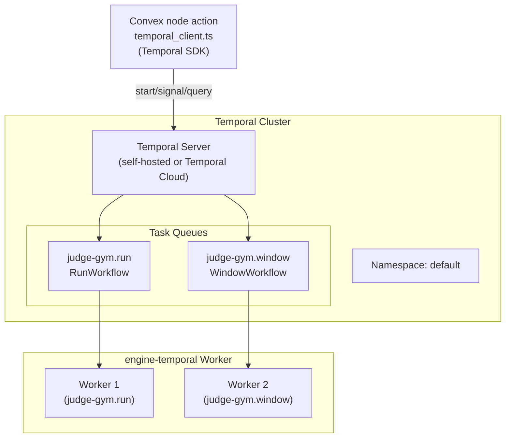

**Connection config (env vars):**

| Var                        | Default          | Purpose            |
| -------------------------- | ---------------- | ------------------ |
| `TEMPORAL_ADDRESS`         | `localhost:7233` | gRPC endpoint      |
| `TEMPORAL_NAMESPACE`       | `default`        | Temporal namespace |
| `TEMPORAL_TLS_ENABLED`     | —                | Enable mTLS        |
| `TEMPORAL_TLS_SERVER_NAME` | —                | TLS SNI override   |

Temporal SDK calls from Convex use `"use node"` actions (Node.js runtime) since the Temporal SDK requires Node APIs.

---

### Convex (Database + Serverless Functions)

Convex provides **serverless database, function execution, and real-time subscriptions** in a single hosted platform.

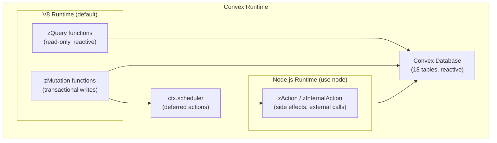

Convex node actions are used exclusively for the Temporal client SDK (which requires Node.js APIs not available in the V8 runtime).

---

### Redis (Quota / Rate Limiting)

Redis provides **atomic token-bucket rate limiting** per provider and model. It is optional — if not configured, all requests are allowed without enforcement.

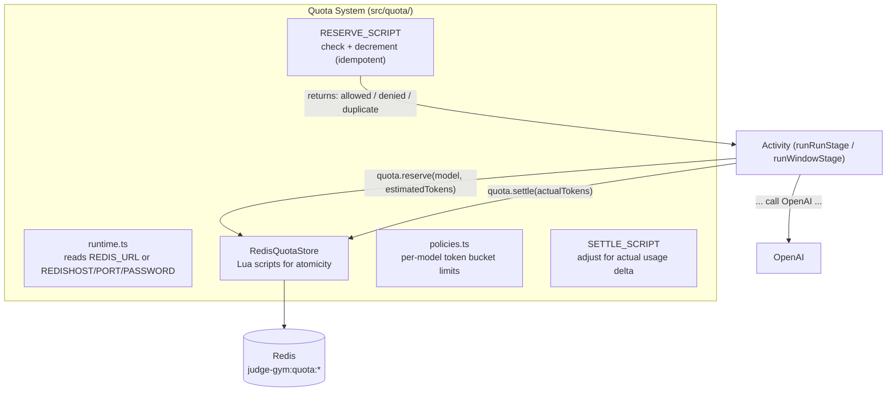

**Token bucket policies (per-minute):**

| Model          | Requests/min | Input tokens/min |
| -------------- | ------------ | ---------------- |
| `gpt-4.1`      | 10,000       | 30M              |
| `gpt-4.1-mini` | 30,000       | 150M             |
| `gpt-5.2`      | 15,000       | 40M              |
| `gpt-5.2-chat` | 15,000       | 40M              |

Pre-call reservation uses estimated token count (`ceil(len / 4)`). Post-call settlement adjusts the bucket for the actual delta.

---

### Firecrawl (Web Search + Scraping)

Used exclusively in the window `collect` stage.

- Endpoint: Firecrawl `search()` API
- Mode: `sources: ["news"]` with date range filtering
- Output: markdown-formatted article content
- Config: `FIRECRAWL_API_KEY`

---

### OpenAI (LLM Inference)

All four run stages and all three window transformation stages call OpenAI directly from the Temporal worker.

- Endpoint: direct `fetch` to `https://api.openai.com/v1/chat/completions`
- Auth: `OPENAI_API_KEY`
- Token usage is captured and stored in `llm_attempts` after each call.
- Model selection is per-experiment-config; validated against the `engine-settings` model registry.

---

### Axiom (Telemetry)

Optional structured logging and tracing.

- Convex mutations emit events to `process_observability` (local mirror) and schedule async Axiom export.
- Local mirror enables fast process health queries without hitting Axiom.
- Config: `AXIOM_DATASET`, `AXIOM_TOKEN`
- Debug: `bun run debug:tail`, `bun run debug:analyze`

---

## Control Plane

The system exposes a rich control plane for pausing, resuming, repairing, and inspecting workflows at runtime.

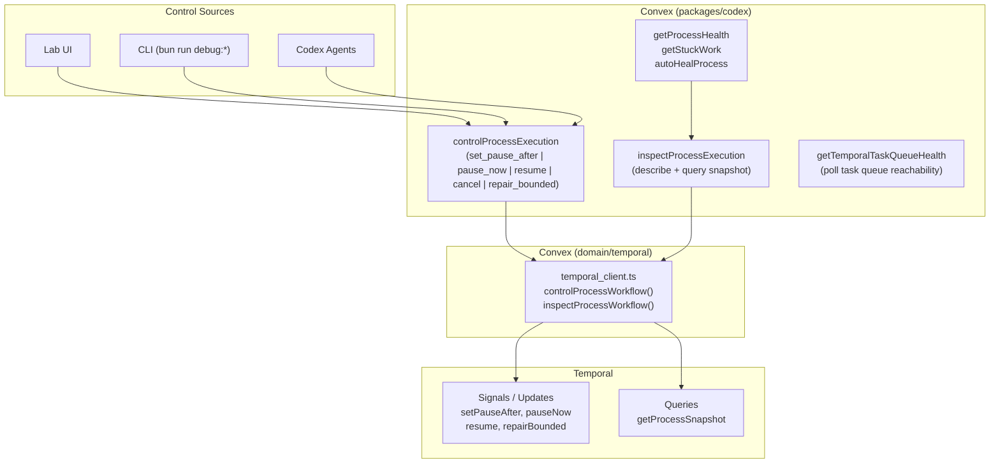

**Repair operations (`repair_bounded`):**

| Operation            | Effect                                              |
| -------------------- | --------------------------------------------------- |
| `reproject_snapshot` | Re-sends the current workflow snapshot to Convex    |
| `resume_if_paused`   | Resumes the workflow only if it is currently paused |
| `clear_pause_after`  | Removes any scheduled pause point                   |

---

## Key Design Decisions

### 1. Temporal as the Orchestration Backbone

Workflows are durable, restartable, and controllable. All pause/resume/cancel/repair operations go through Temporal workflow updates — not Convex state machines. This means the engine survives process crashes, deployments, and network blips without losing work.

### 2. Convex as the Single Source of Truth

Every LLM call, every parsed result, every stage transition, and every process status is stored in Convex. Temporal's workflow state is always a derivative/mirror of what's in Convex. The Temporal worker is stateless with respect to data — it pulls inputs from Convex and writes outputs back.

### 3. Strict Semantic Layering of Evidence

Evidence is stored at four semantic levels (L0–L3). This enables ablation experiments that isolate the effect of identity information (named entities, rhetoric, page chrome) on judge scoring. Experiments can specify which level to present to the scorer.

### 4. Prompt-First, Parse-Last

All LLM outputs follow strict output contracts (`RUBRIC:`, `VERDICT:`, `QUALITY:`, `EXPERT_AGREEMENT:`). Parsing is strict and per-target — a parsing failure on one sample does not block others. Failures are recorded as structured errors in Convex.

### 5. Failure Propagation by Dependency

Stage failures propagate downstream within a sample: `rubric_gen` failure blocks `rubric_critic`, `score_gen`, and `score_critic` for that sample. This prevents orphaned pending work accumulating across long runs.

### 6. Opt-in Redis Quota

If Redis is not configured, the quota system returns `allowed: true` with `reason: "redis_not_configured"`. This makes local development and testing work without any Redis dependency.

### 7. Experiment Randomization is Reproducible

Label mapping (anonymize stage labels), rubric order shuffling, and label text hiding all use seeded PRNGs derived from `sample.seed`. Re-running with the same seed produces identical randomization, enabling reproducibility.

### 8. Public API Gating

The three API packages (`lab`, `worker`, `codex`) are strict boundaries. The Lab UI cannot call internal domain functions directly; neither can the Temporal worker. All cross-boundary calls go through the typed, validated API package layer.
