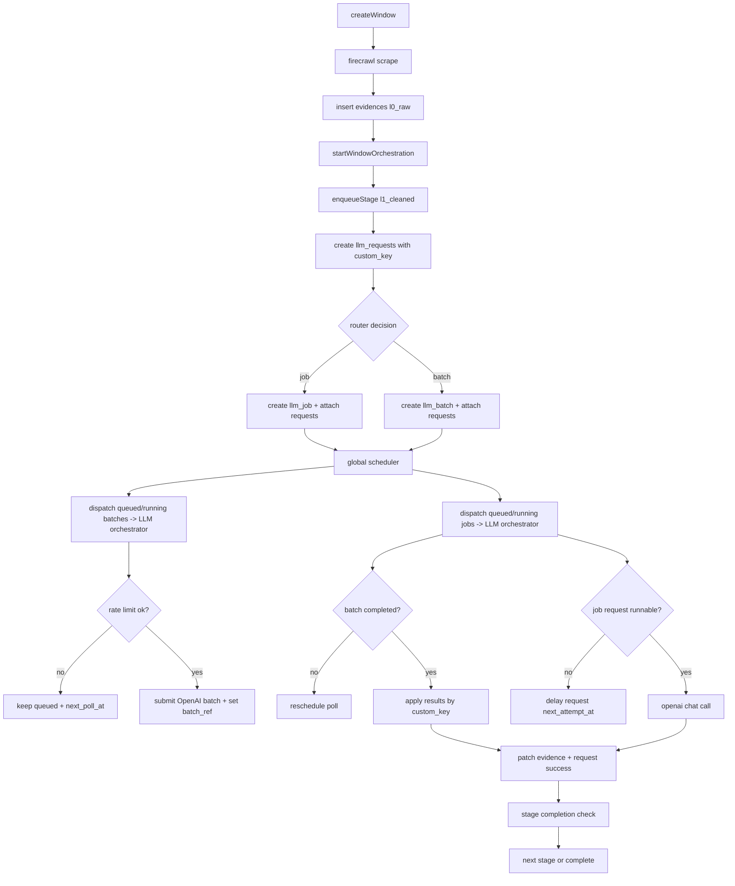

# Orchestrator Lifecycle (judge-gym)

This document describes the end-to-end lifecycle for the global orchestrator,
including batches, jobs, routing, and result application, plus the Convex
function calls that make up each step.

---

## High-Level Overview

The orchestrator manages two process types:

- **Windows**: evidence collection and semantic cleaning stages.
- **Runs**: (future) rubric + scoring stages.

All work is expressed as `llm_requests`. The orchestrator routes requests to:

- **Batches** (for batchable models and sufficient volume), or
- **Jobs** (fallback or non-batchable models).

### Key Concepts

- `custom_key` ties a request to a specific domain row and stage:
  - Request: `evidence:{evidenceId}:{stage}`
  - Batch/Job: `window:{windowId}:{stage}`
- The **global scheduler** is responsible for:
  - polling queued/running batches and jobs
  - dispatching work to the LLM orchestrator
  - rescheduling itself

---

## Lifecycle Diagram (Mermaid)

---

## Component Responsibilities

### Orchestrator Base (`convex/domain/orchestrator/base.ts`)

- Creates `llm_requests` for a stage.
- Routes to batch or job based on policy thresholds and model batchability.
- Creates `llm_batches` or `llm_jobs` and links requests.
- Enforces request/process key encoding and decoding via abstract methods:
  - `makeRequestKey` / `parseRequestKey`
  - `makeProcessKey` / `parseProcessKey`

### Router (`convex/domain/orchestrator/router.ts`)

- Decision rules:
  - If model is not batchable => job
  - If `count < min_batch_size` => job
  - If `count <= job_fallback_count` => job
  - Else => batch

### Window Orchestration (`convex/domain/window/window_orchestrator.ts`)

Stage mapping:

- `l1_cleaned`: `l0_raw_content` -> `l1_cleaned_content`
- `l2_neutralized`: `l1_cleaned_content` -> `l2_neutralized_content`
- `l3_abstracted`: `l2_neutralized_content` -> `l3_abstracted_content`

Results are applied by `custom_key` via `applyRequestResult`.

### Global Scheduler (`convex/domain/orchestrator/scheduler.ts`)

Controls the polling and dispatch loop only:

- Lists active batches/jobs and schedules them for processing.
- Reschedules itself with `poll_interval_ms`.

### LLM Process Workflows (`convex/domain/orchestrator/process_workflows.ts`)

Durable workflows that implement the batch/job processing logic:

- **processQueuedBatchWorkflow**
  - validates queued state
  - applies batch rate limit (`model:batch_requests`)
  - submits OpenAI batch
  - updates batch status/timestamps

- **processRunningBatchWorkflow**
  - polls OpenAI batch status
  - applies results and transitions batch state

- **processQueuedJobWorkflow**
  - per-request rate limit (`model:requests`)
  - calls OpenAI chat completions
  - patches domain rows via `custom_key`

- **processRunningJobWorkflow**
  - continues queued job processing when `next_run_at` is due

### Retry Routing (`convex/domain/orchestrator/llm_orchestrator.ts`)

- **requeueRequest**
  - uses `target_registry` to map target types to handlers
  - reassigns failed requests to jobs (evidence pipeline today)

### Target Registry (`convex/domain/orchestrator/target_registry.ts`)

Maps target types (from `custom_key`) to requeue handlers. This is how
non-window orchestrators plug into retry routing.

---

## Retry and Rate Limit Behavior

### Batch

- `max_batch_retries` controls how many times a batch is retried if the provider fails.
- Batch retries do **not** increment per-request attempts.

### Job / Request

- `max_request_attempts` controls per-request retry count.
- `retry_backoff_ms` delays job retries.
- Rate limit denials do **not** increment attempts; they only set `next_attempt_at`.

### Rate Limit Keys

- Job: `model:requests`, `model:input_tokens`, `model:output_tokens`
- Batch: `model:batch_requests`, `model:batch_input_tokens`, `model:batch_output_tokens`

---

## Current Limitations

- Scheduler currently applies **window evidence** results.
- Run orchestration and run-stage result handling are not wired yet.
- Only OpenAI batch/chat are implemented.

---

## Convex Function Calls

### Window kickoff and enqueue

- `internal.domain.window.window_service.startWindowOrchestration`
  - initializes window state and calls `enqueueStage` for `l1_cleaned`.
- `internal.domain.window.window_service.enqueueWindowStage`
  - uses `WindowOrchestrator.enqueueStage` to create requests and route them.

### LLM request creation and routing

- `internal.domain.llm_calls.llm_request_repo.createLlmRequest`
- `internal.domain.llm_calls.llm_batch_repo.createLlmBatch`
- `internal.domain.llm_calls.llm_job_repo.createLlmJob`
- `internal.domain.llm_calls.llm_batch_repo.assignRequestsToBatch`
- `internal.domain.llm_calls.llm_job_repo.assignRequestsToJob`

### Scheduler loop

- `internal.domain.orchestrator.scheduler.startScheduler`
- `internal.domain.orchestrator.scheduler.runScheduler`
  - starts workflows:
    - `internal.domain.orchestrator.process_workflows.processQueuedBatchWorkflow`
    - `internal.domain.orchestrator.process_workflows.processRunningBatchWorkflow`
    - `internal.domain.orchestrator.process_workflows.processQueuedJobWorkflow`
    - `internal.domain.orchestrator.process_workflows.processRunningJobWorkflow`

### Batch processing

- `internal.domain.orchestrator.process_workflows.processQueuedBatchWorkflow`
- `internal.domain.orchestrator.process_workflows.processRunningBatchWorkflow`
  - uses OpenAI batch adapter via internal actions in `process_workflows.ts`

### Job processing

- `internal.domain.orchestrator.process_workflows.processQueuedJobWorkflow`
- `internal.domain.orchestrator.process_workflows.processRunningJobWorkflow`
  - uses OpenAI chat adapter via internal actions in `process_workflows.ts`

### Result application

- `internal.domain.window.window_service.applyRequestResult`
  - patches `evidences` rows and marks `llm_requests` success.

### Retry routing

- `internal.domain.orchestrator.llm_orchestrator.requeueRequest`
  - delegates to `target_registry` handlers.

---

## Files

- `convex/domain/orchestrator/`
  - `base.ts` (orchestrator base)
  - `router.ts` (routing decision)
  - `scheduler.ts` (minimal scheduler)
  - `llm_orchestrator.ts` (retry routing)
- `convex/domain/llm_calls/`
  - `llm_batch_service.ts` (batch processing)
  - `llm_job_service.ts` (job processing)
  - `target_registry.ts` (retry routing registry)
- `convex/domain/window/window_orchestrator.ts` (window-specific orchestration)
- `convex/domain/window/window_service.ts` (window entrypoints + result apply)
